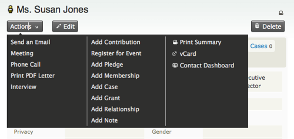
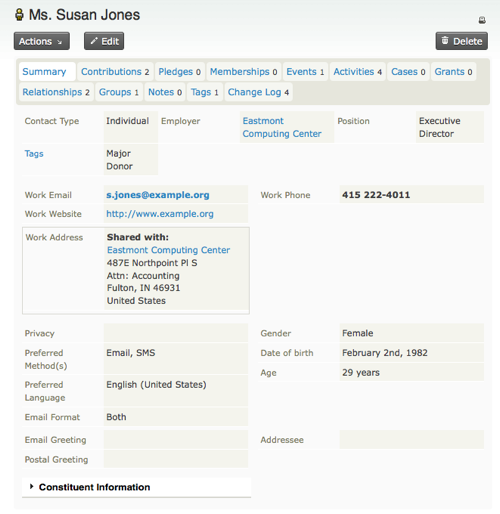
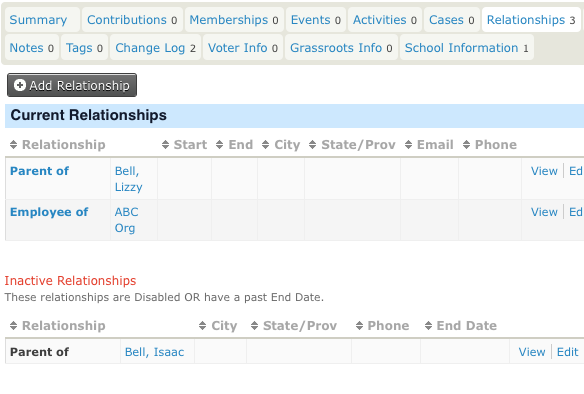
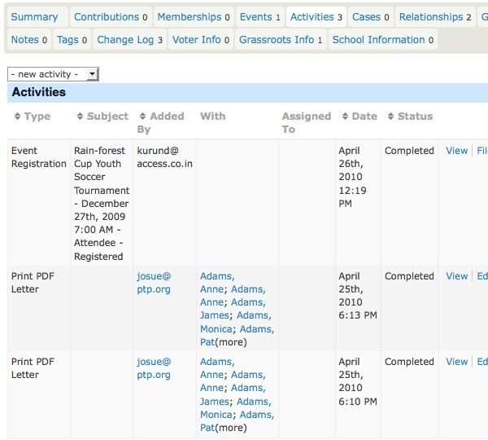
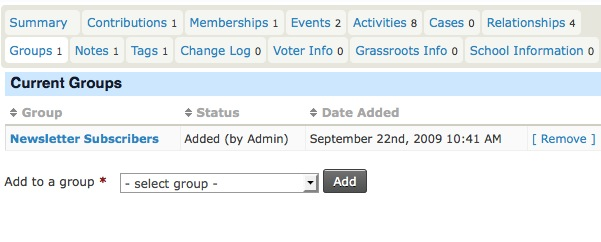
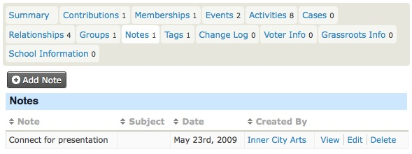
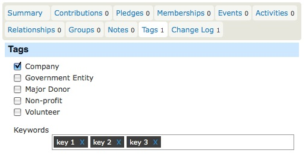
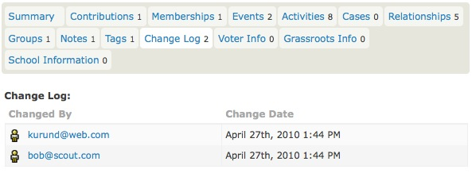
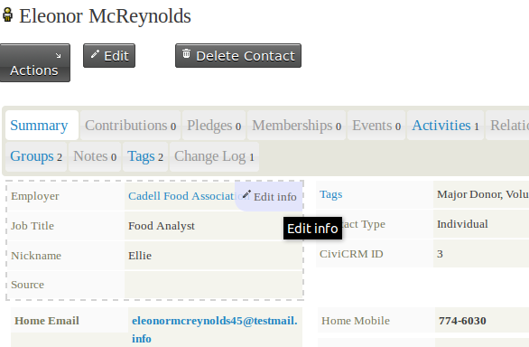

# Contacts

This chapter introduces contacts: the basic building block of this system.  
We look at how to find, view, add, edit, and delete contacts. We also examine ways to extend and customize contacts and adjust their appearance in the user interface.

Out of the box, this system supports three contact types:

-   **Individuals** – e.g., people such as staff or suppliers.
-   **Organizations** – e.g., entities such as companies or member institutions.
-   **Households** – typically families that share a physical address (less commonly used in this context).

Each contact record comes with a set of **core fields**, including:

-   names (e.g., first and last name for individuals or organization name for entities);
-   greetings and addressee fields for different communication methods;
-   contact methods (e.g., email addresses, phone numbers, websites);
-   addresses (e.g., physical locations);
-   communication preferences, such as methods they prefer or opt-out methods.

You can define new **contact subtypes** based on the out-of-the-box contact types. You can also add custom fields that extend all contacts or only specific contact types or subtypes.

Think of contacts as the central element of the system. All other building blocks—like relationships, activities, groups, and contributions—connect to contacts in some way.

---

## A Quick Look at Contacts

Contacts are organized into tabs. The first tab that you see when viewing a contact is the **summary tab**, which contains basic contact details. Other tabs display information about specific aspects of the contact. This tabbed organization helps manage the large amount of data that can be collected over time.

Tabs appear or disappear based on the system components enabled and the permissions granted. For example, you will only see the memberships tab if the membership component is enabled and you have the required permissions. Extra tabs can also be defined to display additional custom data.

Below, we outline the most important parts of the contact screen.

---

### Contact Actions

Above the tabs, you will see the **Actions** button. This is a handy shortcut for performing actions related to the contact, such as adding notes or recording a new activity.

---

### Summary Tab

The summary tab provides an overview of your contact, including names, addresses, and contact details.

Some fields are unique to certain contact types:
- For **Individuals**, fields like first name, last name, and nickname are displayed.
- For **Organizations**, fields like organization name and type are shown.

#### Individual Fields
Individual names can include prefixes, first name, middle name, last name, suffixes, and nicknames. Prefixes and suffixes are chosen from a dropdown list, which can be configured under:  
**Administer > Customize Data and Screens > Dropdown Options > Individual Prefixes (Ms., Mr., etc.)**.

#### Addresses
Contacts can have multiple addresses categorized by location type (e.g., work, home). One address can be marked as the primary address for communication purposes.

If a contact shares an address with another contact (e.g., an individual and their employer), the system allows address sharing for easier updates.

#### Phone Numbers
Multiple phone numbers can be stored for each contact, categorized by type (e.g., work, mobile). Phone numbers marked as "mobile" can be used for SMS communication.

#### Email Addresses
Contacts can have multiple email addresses. One address can be designated for bulk emails (e.g., newsletters). Bounced emails are automatically marked as "on hold."

---

## Additional Tabs and Features

### Relationships Tab

Relationships connect contact records in meaningful ways. For instance, an individual may have a "works for" relationship with an organization. The system displays both current and inactive relationships.

---

### Activities Tab

The activities tab displays a chronological list of interactions with a contact, including meetings, phone calls, and other activities. Custom activities can also be added.

---

### Groups Tab

The groups tab shows the groups a contact belongs to. Groups are useful for organizing contacts into categories, mailing lists, or permission sets.

---

### Notes Tab

The notes tab is for recording unstructured information about a contact. Notes can be restricted for viewing by the author only, ensuring privacy.

---

### Tags Tab

Tags allow you to categorize contacts flexibly. You can search for contacts based on tags or use them to create smart groups.

---

### Change Log Tab

This tab provides a limited log of changes made to a contact, showing who made the changes and when.

---

## Adding Contacts

You can add new contacts via **Contacts > New Contact**. During creation, the system checks for duplicates to prevent redundant entries. Required fields depend on the contact type:
- **Individuals**: First name and last name or an email address.
- **Organizations**: Organization name.

Multiple addresses can be added to a contact. Shared addresses can link contacts for consistency.

---

## Editing Contacts

Editing can be done directly from the summary tab or via the **Edit** button. The system prevents data conflicts by notifying users of simultaneous edits by others.

---

## Deleting Contacts

Deleted contacts are moved to the trash, allowing recovery. Contacts can be deleted individually or in bulk using advanced search.

---

## Contact Subtypes

Subtypes extend the functionality of the core contact types, allowing you to collect data specific to certain roles or categories. For instance:
- **Individuals** can be subtyped into "Tender Participants" or "Procurement Managers."
- **Organizations** can be subtyped into "Suppliers" or "Member Institutions."

Subtypes enable custom fields and tailored data collection.

---

## Customizing Contact Views

The system allows you to customize how contact information is displayed, including:
- Hiding unnecessary fields or tabs.
- Rearranging the order of displayed information.
- Adding or removing fields for specific data categories.

---

Contacts are the core of the system, connecting all other elements such as activities, relationships, and groups. Managing contacts effectively ensures the smooth operation of the system and enhances collaboration with suppliers and members.
