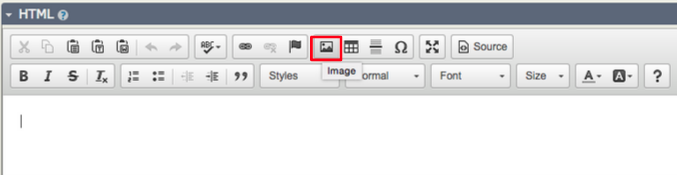
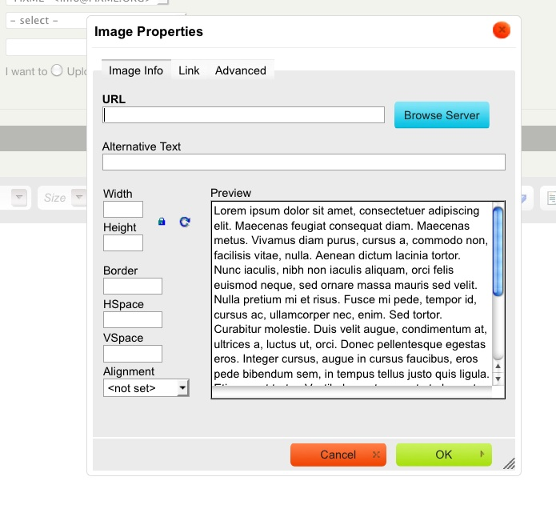
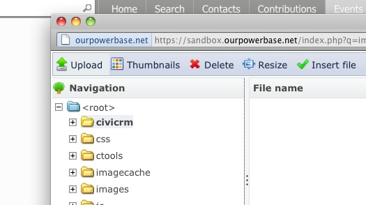
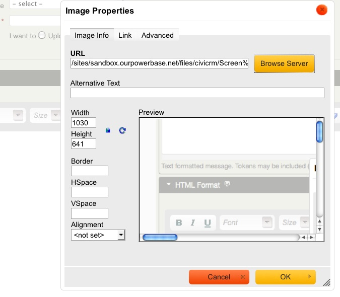

# Everyday Tasks

This chapter provides step-by-step instructions for performing key everyday email tasks in this system. For sending mass mailings, refer to [Mass Mailings Using CiviMail](mass-mailings-using-civimail.md).

---

## Send an Email to One Person (with CC and BCC)

You can send an email to an individual using CiviCRM, which is useful for maintaining a record of the communication or for using predefined templates.

1. **Find the contact to email**:
   - Use the Quick Search box in the navigation menu. Start typing part of the person's name or email address and select them from the suggestions.
   - Alternatively, go to **Search > Find Contact**, enter part of the contact's name or email, click **Search**, and select their name from the results.
2. **Send the email**:
   - From the contact summary page, select **Actions > Send an Email**, or go to the **Activities** tab and choose **Send an Email** from the dropdown menu.
3. Add recipients in the CC and BCC fields as needed.
4. If applicable, select a template from the **Use Template** dropdown menu. Templates prepopulate the email with content that you can edit.
5. Enter your content:
   - For a plain-text email, ignore the HTML Format section and enter your message in the **Plain Text Format** section.
6. Click **Send**.

The email activity will be recorded under the **Activities** tab for both the sender and the recipient.

---

## Send a Quick Email to Fewer Than 50 Contacts

For quick communication with a small group of contacts, you can send an email to up to 50 recipients directly from the search results.

1. **Find the contacts**:
   - Go to **Search > Find Contacts** (or use **Advanced Search** or another search method), enter your criteria, and click **Search**.
2. From the results screen, select the desired contacts and choose **Actions > Email - send now (to 50 or less)**.
3. Follow the same steps as for sending an email to one person.

Each recipient’s email will be logged as an activity in their record, and the sender will also have the activity logged, listing all recipients.

!!! note
    Recipients will only see their own email address in the **To** field. Consider mentioning the group of recipients in the email content, e.g., "TO: Members of the board, staff."

---

## Insert an Image in an Email

Adding images to your email is straightforward using the WYSIWYG editor.

1. Click the **Image** button in the WYSIWYG editor.

   

2. In the **Image Properties** window, click **Browse Server** to locate the image.

   

3. If the image is already uploaded:
   - Navigate through the directories in the sidebar, locate the image, and select it.
4. To upload a new image:
   - Click **Upload**, choose the image file from your computer, and click **Open**. You can upload multiple files at once.

   

5. Insert the image:
   - Double-click the selected image to return to the **Image Properties** window.
   - Adjust size, alignment, or border settings as needed.
   - Fill in the **Alternative Text** field for accessibility (displayed when the image is not loaded or for users with visual impairments).

   

6. Click **OK** to insert the image into your email.

!!! tip
    Always include descriptive alt text for images to make emails accessible for all users.

---
