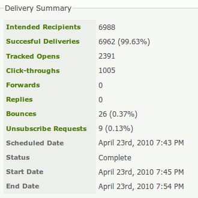
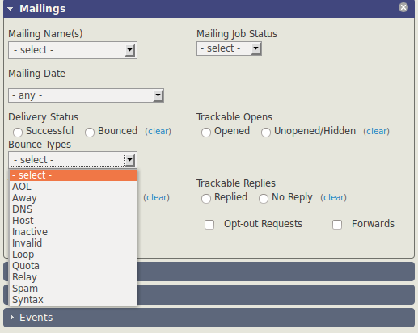
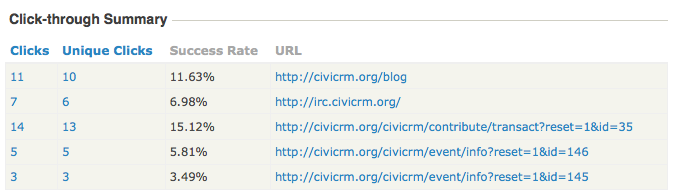

# Reports and Analysis

CiviMail offers robust tools for tracking and analyzing your email campaigns. These tools help measure effectiveness, manage email deliverability, and understand recipient engagement.

---

## Individual Mail Reports

You can view reports for individual mailings by navigating to **Mailings > Scheduled and Sent Mailings**. These reports update in real time, allowing you to track email performance as data comes in. The availability of data depends on the tracking options enabled during mailing setup.

### Delivery Summary

The delivery summary provides high-level statistics, with clickable links for detailed recipient lists.

**Key Metrics**:

- **Intended Recipients**: The total number of contacts the email was intended for.
  
- **Unique Opens**: The number of unique recipients (or bots) who opened the email. This requires enabling *Open Tracking*.
  
- **Total Opens**: The total number of times the email was opened, including multiple opens by the same recipient.

  !!! info "How Open Tracking Works"
      CiviCRM tracks opens by embedding a unique, small image in each email. When a recipient’s email client downloads this image, it registers as an "open." Since many email clients block image downloads by default, the actual number of readers is likely higher than reported. Use these statistics for comparative analysis rather than exact measurement.

- **Click-Throughs**: The total number of link clicks, available if *Click Tracking* is enabled.

- **Forwards**: The number of times the email was forwarded using a provided forward link.

- **Replies**: The number of recipient replies, available if *Reply Tracking* is enabled.

- **Bounces**: The number of undelivered emails, provided *Bounce Processing* is set up.

- **Unsubscribe Requests**: The number of recipients who clicked on unsubscribe links.

---

## Managing Bounces and Contacts with Invalid Emails

If your server processes bounces, contacts with invalid email addresses will be marked **On Hold**, preventing further emails from being sent to those addresses. You can address bounces as follows:

1. **Review Bounces**:
   - Click the **Bounces** link in the Delivery Summary to view detailed reasons for bounces.
   - Common reasons include incorrect addresses (e.g., contact@gooogle.com).

2. **Fix Email Addresses**:
   - Correct invalid email addresses and remove the **On Hold** status.
   - You can reuse the mailing by excluding recipients of the original mailing during setup.

3. **Advanced Search**:
   - Use **Search > Advanced Search** and filter by bounce type in the Mailings area to identify and address specific bounce issues.

---

## Click-Through Summary

This section provides detailed statistics for each link in your email.

**Metrics**:

- **Clicks**: The total number of times a link was clicked.
  
- **Unique Clicks**: The number of distinct recipients who clicked the link.

---

## Mailing Reports with CiviReport

CiviReport offers advanced reporting capabilities that complement individual mailing reports. Key advantages include:

- **Comprehensive Reporting**: Generate reports for multiple mailings simultaneously.
  
- **Advanced Features**:
  - Add reports to dashboards.
  - Schedule and email reports to team members.

### Available Reports:

- **Mail Bounce Report**: Details of bounced emails.
- **Mail Summary Report**: High-level statistics for multiple mailings.
- **Mail Clickthrough Report**: Summary of link engagement across mailings.
- **Mail Opened Report**: Insights into email opens across campaigns.