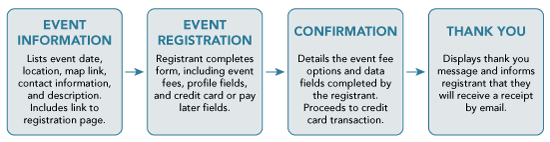
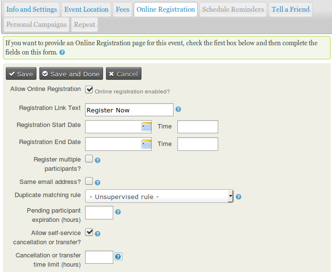
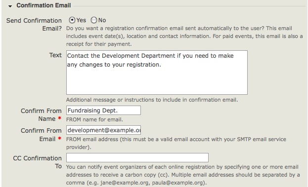

# Online Event Registration

The ability for suppliers to register for information sessions online provides convenience for them and reduces administrative work for your organization. This guide details how to enable and configure online registration for events in the system.

The standard flow for online registration follows these steps:

1. **Event Information**: Provides details such as the session date, time, location, map link, and a description of the event, along with a link to the registration page.
2. **Event Registration**: Participants fill out the registration form, including any required information or fees.
3. **Confirmation**: A page summarizes the participant’s entered details and confirms their registration.
4. **Thank You**: A final page informs participants that their registration is complete and they will receive a receipt via email.

---

## Setting Up Online Registration

To enable online registration, select **Allow Online Registration** in the **Online Registration** tab when creating or editing an event. Use the options on this tab to configure the registration process.

Key configurations include:

- **Link Text**: Define the text displayed for the registration link (e.g., "Register Now").
- **Registration Start/End Dates**: Specify when users can register online. The registration period can close before the event start date if administrative preparation is needed.
- **Register Multiple Participants**: Allows a single user to register multiple people. Each registration creates a separate contact record.
- **Allow Same Email for Multiple Registrations**: Enables multiple registrations using the same email address, useful for situations like purchasing additional tickets.

---

## Collecting Participant Information with Profiles

Profiles are used to collect participant information during registration. For example, fields for first name, last name, and email address can be included. The default profile, "Your Registration Info," is preconfigured, but you can customize or create new profiles to suit your event’s needs.

!!! warning
    Modifying an existing profile applies changes to all instances where it is used. To avoid unintentional changes, copy the profile and edit the copy as needed.

Custom fields can be added to profiles, either for all events or specific event types and participant roles. See the [Profiles](../organising-your-data/profiles.md) section for more details.

---

## Registration Confirmation

Configure the content displayed on the confirmation page, thank-you page, and in email receipts. For paid events, the confirmation step includes payment processing.

Enable **Send Confirmation Email** to ensure registrants receive an acknowledgment and, for paid events, a receipt. Set a valid **Confirm From Email** address to avoid delivery issues.

---

## Optional Features for Event Registration

### Waitlists

If attendance is limited, enable the **Waitlist** feature to manage overflow registrations. Participants added to the waitlist will receive notifications and the opportunity to register if space becomes available.

To enable:

1. Go to **Administer > CiviEvent > Participant Statuses** and enable **On waitlist** and **Pending from waitlist**.
2. Check **Offer Waitlist** on the event’s **Info and Settings** tab.

### Participant Approval

For invite-only sessions, enable **Require Participant Approval**. Registrants will receive an initial acknowledgment, and you can approve or reject them manually.

To enable:

1. Go to **Administer > CiviEvent > Participant Statuses** and enable **Awaiting Approval**, **Pending from approval**, and **Rejected**.
2. Check **Require Participant Approval** in the event’s **Online Registration** tab.

---

## Managing Duplicates During Registration

Duplicate prevention ensures that registrations are matched to existing contacts where possible. Configure a **Duplicate Matching Rule** in the **Online Registration** tab to define how registrants are matched to existing records.

If profiles lack sufficient fields for matching, warnings such as "Duplicate Matching Impossible" or "Duplicate Contacts Possible" may appear. Adjust the profiles or duplicate rules to resolve this.

---

## Permissions for Online Registration

Review and configure user permissions to ensure appropriate access to registration forms:

- Anonymous users typically need permissions for **register for events** and **view event info**.
- If custom fields or profiles are used, assign **access all custom data** and **profile create** permissions.

For access control based on specific groups, use the system’s ACL (Access Control List) functionality.

---

## Testing the Registration Process

Before going live, test the registration process to identify and fix any issues:

1. Navigate to **Events > Manage Events** and select **Test-drive** for the event.
2. Complete a registration as both an anonymous and authenticated user.
3. Review the test participant record in **Events > Find Participants**.

Adjust the event settings as needed and test again. Once satisfied, publish the event on your website.

---
By following these steps, you can configure a seamless online registration process tailored to your organization’s needs.