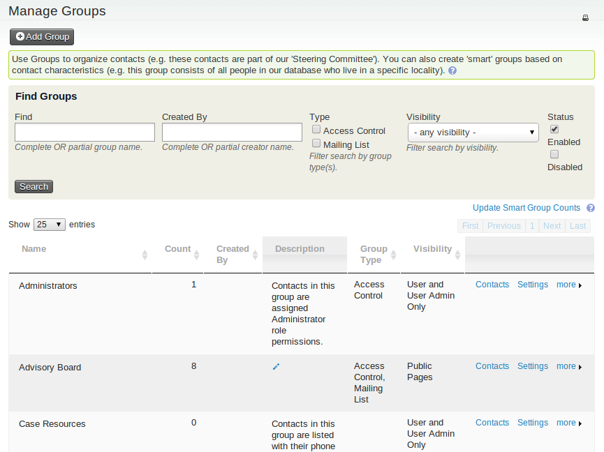
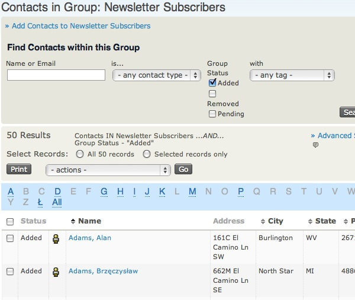
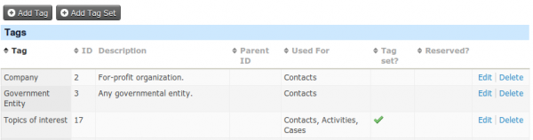
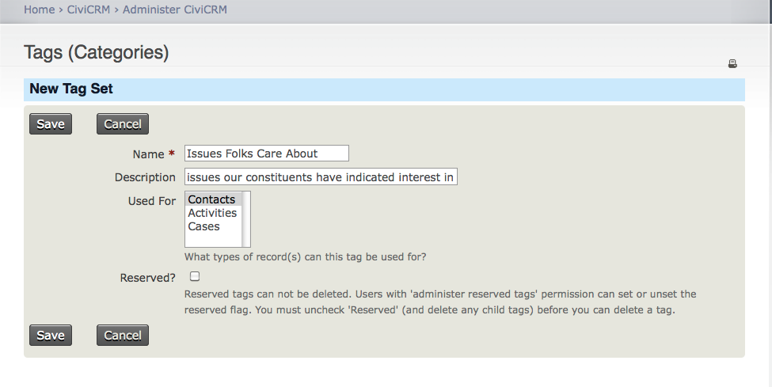

# Groups and Tags

Groups and tags are two key methods of organizing data in this system.  
When used properly, both allow for powerful segmentation and searching of your database.

Since both groups and tags are methods of categorization, it can be difficult to determine whether a tag or a group is more appropriate in a given situation. Identifying the differences in their functionality will help you decide which to use.

It can also be helpful to have a conceptual understanding of the differences between the two. Though there are different takes on how tags and groups should be used, a common philosophy is that tags should be used for descriptive categories of contacts, activities, and other records, while groups should be used for grouping people or entities into a cohesive unit (for example, to send communications).  

From this perspective, descriptors like *supplier*, *preferred vendor*, *attended info session*, or *high-priority contact* could be tags for categorizing contacts, while *Regional Tender Group*, *Supplier Network*, or *Info Session Registrants* would be groups that you could add contacts to.

---

## Groups

Groups are a crucial feature within this system.  
In addition to their use as collections of contacts with something in common, they play a critical role in segmenting contacts for communications and other workflows.

There are two kinds of groups: **Regular Groups** and **Smart Groups**.

-   **Regular Groups**: These are groups you manually manage by adding and removing contacts.  
    For example, you could assign your organization's procurement managers to a group called *Procurement Team*. You could then easily send team-related emails to everyone in the group without needing to search for them individually.
    
-   **Smart Groups**: These are automatically populated groups configured to include contacts that meet specific criteria.  
    For example, you might create a Smart Group for *Active Vendors* that includes contacts tagged as suppliers who have participated in a tender within the last year. As new contacts meet these criteria, they are automatically added to the group. Similarly, you might create a Smart Group for *Outstanding Submissions* to track participants with uncompleted tender requirements.

---

### Group Settings and Functionality

Each group should have a clear name and a description that explains its purpose, making it easy for all users to understand.  
This clarity becomes especially important as your organization creates more groups over time.

Groups can be assigned the following standard types:

-   **Mailing List**: Used if you plan to send bulk communications to this group.
-   **Access Control** (if applicable): Used to define permissions for a group of users.

It is also possible to create additional group types to reflect your specific needs. For instance, if your organization uses groups for regional segmentation, you could define a custom group type for regions.

---

### Visibility

Visibility determines permissions for joining and removing contacts from groups.  
You can configure groups as:

-   **User and User Admin Only**: Group membership is managed by authorized system users.  
-   **Public Pages**: Contacts can join or leave the group themselves using forms or other public-facing interfaces.

Some organizations find it useful to create parent-child group relationships.  
For example, you might assign regional office groups (e.g., *Western Office*, *Eastern Office*) as child groups under a parent group called *National Office*. Sending a message to the parent group would include all members of the child groups.

---

### Group IDs

Each group is assigned a unique numeric ID.  
This ID can be used in various operations, such as creating URLs for group-specific sign-ups.

---

## Tags

**Tags** are used to categorize contacts, activities, and other records in the system.  
You can create as many tags as necessary to classify records, but it is advisable to avoid duplication or creating unnecessary tags. Establishing a standard process for creating and using tags can help keep the system organized.

---

## Groups versus Tags {#groups-vs-tags}

This is a common question, and the philosophy described earlier provides a guideline. However, you might need to adapt based on how you intend to segment and manage your data.

The following outlines the key differences:

#### Benefits of Tags
-   Easy to set up and use.  
-   Easy to search using both Basic and Advanced Search.  
-   Can be combined with other criteria (e.g., roles, regions) to create Smart Groups.

#### Limitations of Tags
-   Tags cannot be limited to specific contact types.  
-   Exporting tags consolidates all assigned tags into a single list for each record.  
-   Tags allow multiple selections, which may not be ideal for mutually exclusive characteristics.

#### Benefits of Groups
-   Groups provide flexibility for recurring tasks, such as sending newsletters or generating reports.  
-   Groups enable subscription and unsubscription workflows, with a history of actions.  
-   Groups can include Smart Groups for dynamic updates.

#### Limitations of Groups
-   Managing too many groups can become cumbersome.  
-   Groups created for short-term purposes should be regularly reviewed and purged if no longer needed.

---

## Managing Groups

To view and manage all groups, navigate to: **Contacts > Manage Groups**.

You can:

-   Add contacts to a group.  
-   Edit group settings.  
-   Disable or delete groups that are no longer needed.  
-   View the number of contacts in each group.

---

## Finding Contacts in a Group

You can search for contacts within a group by name, email, or other criteria.  
This functionality is accessible from the group management page.

---

## Working with Tags

Tags can be viewed and managed via: **Contacts > Manage Tags**.

Each tag should have a clear name and description. Tags can be assigned to:

-   Contacts  
-   Activities  
-   Cases  

Tags are a flexible tool, but important tags can be locked to prevent accidental changes.

---

## Tag Sets

Tag sets allow you to group related tags together.  
For example, you might create a tag set called *Supplier Characteristics* with tags like *Preferred Vendor*, *High-Volume Supplier*, or *In Good Standing*.

Tag sets can be added via: **Contacts > Manage Tags > Add Tag Set**.

Tag sets appear in contact records and provide additional search options in Advanced Search.

---

Groups and tags together provide powerful ways to organize and manage your data effectively. By carefully considering their use, you can ensure optimal segmentation and workflow efficiency.
