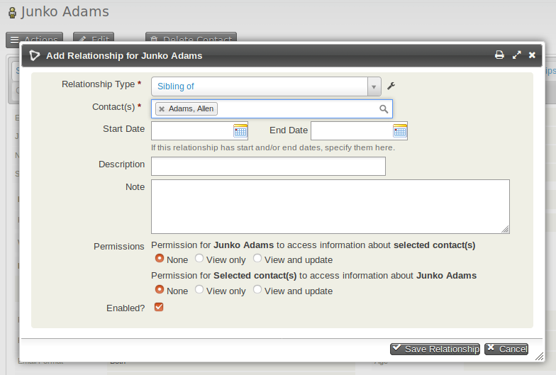

# Relationships

This system allows you to represent connections between contacts by creating relationships.  
For example, if an organization and its representatives are both in your database, it is useful to view either record and see that they are related.

You can also track relationships between organizations or between individuals and organizations. For example, entering an organization in the **Employer** field of an individual's record automatically creates an "Employee of" relationship from the individual to the organization and an "Employer of" relationship from the organization to the individual.

---

## Creating Relationships Between Contacts

1.  Navigate to one of the records you want to relate.
2.  Click on **Add Relationship** from the **Actions** button on the contact summary or from the Relationships tab.
3.  Select the **Relationship Type**. For example, "Supplier Contact for" or "Works With."
4.  Begin typing the name of the related contact(s). If the related contact is not yet in the database, you can create a new contact from this screen.
5.  Optionally enter further information:  
    - **Start Date** and **End Date** for time-limited relationships.  
    - **Description** for a short note about the relationship.  
    - **Notes** for additional details about the relationship.  
    - **Permissions** to allow others to view or update the related contact.  
    - **Enabled** to indicate that the relationship is active.  
6.  Click **Save Relationship** when you are done.

---

### Relationship Permissions

If a relationship is created between two contacts (e.g., Contact A and Contact B), and the **Permissions** box is set to allow Contact A 'View' access to Contact B, then Contact A can view Contact B's details. If the permission is set to 'View and Update,' Contact A can also update details for Contact B.

---

## Connecting Employees and Employers

A quick way to connect employees (individual contacts) to employers (organization contacts) is to use the **Employer** field in an individual's record. This creates the relationship automatically.

1.  Navigate to the individual’s record.
2.  Click **Edit**.
3.  Begin typing the organization name in the **Employer** field.  
    - If the organization already exists, select it from the dropdown.  
    - If it does not exist, type the name to create a new organization contact.  
4.  Click **Save**.  
    - The system will create an "Employee of" and "Employer of" relationship automatically.  

---

### Other Ways Employees and Employers Can Be Connected

The **Employer** field can also be included on public forms. When processed, the system will attempt to match the employer name to an existing organization to avoid duplicates.

---

## Adding Contacts to Organizations

1.  Select desired contacts from search results.
2.  Select **Add relationship - to organization** from the dropdown Actions menu.
3.  Choose a **Relationship Type** from the dropdown.  
4.  Enter part of the organization's name in the **Find Target Organization** field and click **Search**.  
5.  Select the matching organization or create a new one.  
6.  Click **Add to Organization** to save the relationship.

---

## Adding Contacts to Households

1.  Select desired contacts from search results.
2.  Select **Add relationship - to household** from the dropdown Actions menu.
3.  Choose a **Relationship Type** (e.g., Household Member of).  
4.  Enter part of the household name in the **Find Target Household** field and click **Search**.  
5.  Select the matching household or create a new one.  
6.  Click **Add to Household** to save the relationship.

---

## Creating New Relationship Types

This system includes default relationship types, but you can create custom relationship types as needed.

1.  Navigate to: **Administer > Customize Data and Screens > Relationship Types**.  
2.  Review existing relationship types to avoid duplicates.  
3.  Click **New Relationship Type**.  
4.  Enter descriptive labels for the relationship:  
    - **Label-A to B** (e.g., "Supplier for").  
    - **Label-B to A** (e.g., "Client of").  
5.  Define **Contact Type A** and **Contact Type B** (e.g., Individual and Organization).  
6.  Optionally add a **Description**.  
7.  Click **Save**.  

---

## Disabling or Deleting Relationship Types

If a relationship type is no longer needed, you can disable or delete it.

1.  Navigate to: **Administer > Customize Data and Screens > Relationship Types**.  
2.  Find the relationship type and click **More**.  
3.  Select **Disable** or **Delete**.  
    - Disabled types remain visible for existing data but cannot be used for new relationships.  
4.  Confirm your action.

Disabled types can be re-enabled later if needed.

