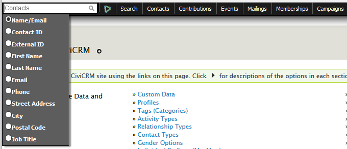
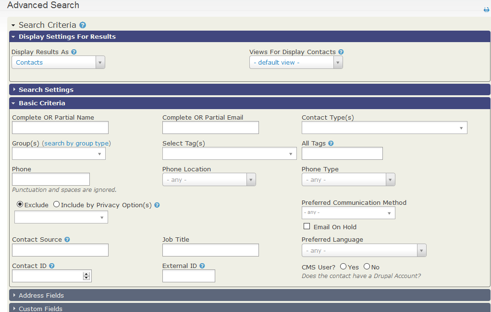
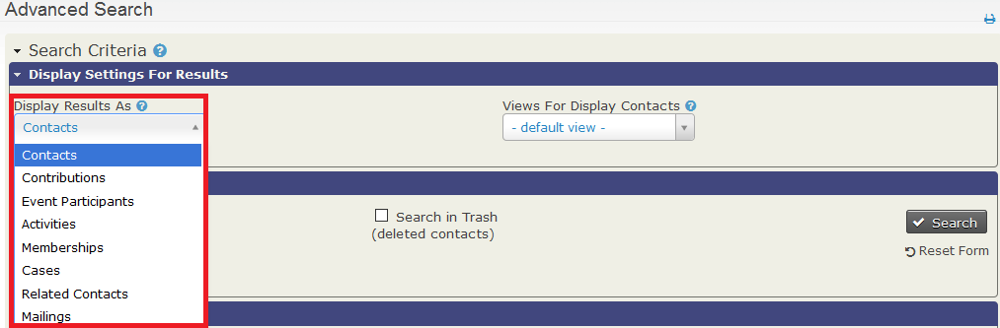
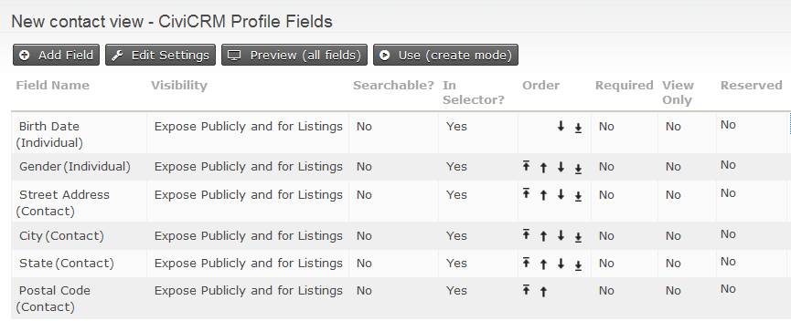
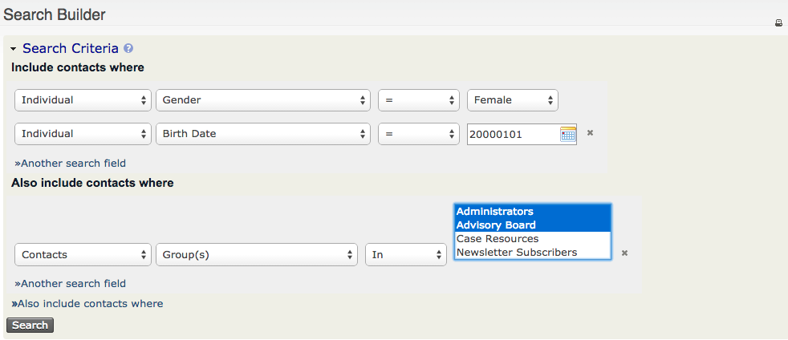
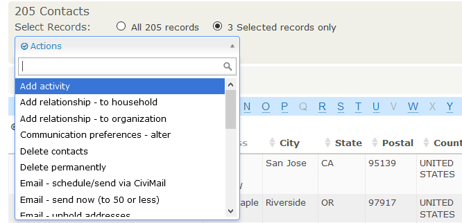
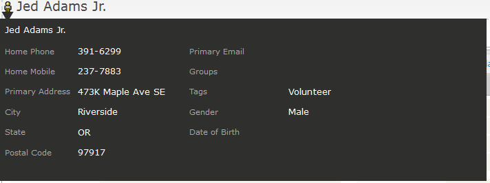

# Introduction

This chapter covers different ways to find information stored in this system.

We will start with basic searches and then move on to more advanced techniques. New users should familiarize themselves with Quick Search, Advanced Search, and component-specific searches. More experienced users may also explore [Search Kit](../searching/searchkit/what-is-searchkit.md), reports, custom searches, and Search Builder.

---

## Overview

This section provides an overview of various search features:

- **Quick search** - Quickly find contacts.
- **Advanced search** - Perform detailed searches with numerous criteria.
- **Search Builder** - Create custom searches tailored to your needs (consider using [Search Kit](../searching/searchkit/what-is-searchkit.md) for newer versions).
- **Full-text search** - Search across all available text fields in the database.
- **Component search** - Search within specific entities such as events, memberships, or contributions.
- **Custom searches** - Use specialized searches tailored to specific needs.
- **Search actions** - Perform actions on search results, such as exporting data or adding contacts to groups.
- **The contact summary pop-up** - View and edit key details from search results.
- **The wildcard (%)** - Use `%` or `%_%` in searches as a wildcard for flexible matching.
- **Case sensitivity** - Understand how case affects search results.
- **Default number of rows** - Adjust the number of results returned in searches.
- **Search Kit** - Explore the possibilities of this advanced search functionality.

---

## Searching and Reporting

Searching can fulfill various purposes:

- **Finding specific records**: The Quick Search box can locate records by name, email, or other characteristics.
- **Performing actions on results**: For example, find all recently expired memberships to send renewal reminders or locate organizations in specific categories to send communications.
- **Ad-hoc reporting**: Search results can serve as informal reports, though they are limited in terms of grouping or summarizing data. For advanced reporting, see the [Reporting](../reporting/what-is-civireport.md) section.

---

## Quick Search

The Quick Search box allows you to locate specific records quickly. You can search by several criteria, which can be customized via **Administer > Customize Data and Screens > Search Preferences**.

When typing in the Quick Search box, suggestions appear as a dropdown based on matching criteria. For example, searching for "peter" may return:

- People named Peter.
- Contacts with "Peter" in their name, e.g., Mary Peterson.
- Contacts with an email address containing "Peter," e.g., bluepeter@gmail.com.
- Organizations with "Peter" in their name, e.g., Alpeter Community Centre.

---

## Advanced Search

Advanced Search allows you to search across all available data. Criteria are grouped into sections (e.g., address, demographic data, or component-specific data like memberships). Expand the relevant section to set your criteria.

### Display Settings for Results

Search results are displayed as contact records by default, but you can choose other record types, such as memberships or contributions, using the **Display Results As** dropdown.

### Custom Views for Search Results

To customize columns displayed in results, create a Profile with the **Search Views** option selected. This allows you to include or exclude fields such as custom data or other relevant attributes. See the [Profiles](../organising-your-data/profiles.md) section for more details.

---

## Search Builder

Search Builder offers flexible search options with a range of operators and logical groupings (AND/OR). For example, find "females born after January 1, 2000 OR members of the Advisory Board."

Search results can be saved as Smart Groups for dynamic population based on criteria.

---

## Full-text Search

This feature searches for text values across all database fields, useful for locating specific records when only partial details are remembered (e.g., keywords in an activity description).

---

## Component Searches

Specific component searches (e.g., **Find Contributions**, **Find Participants**) provide targeted results. Each search has its own set of actions. For example, **Find Members** displays membership records, which can be used for renewals or updates.

---

## Custom Searches

Custom searches address specific questions not easily answered with Advanced Search or Search Builder. Go to **Search > Custom Search** to explore prebuilt searches or create your own. Examples include:

- **Include/Exclude Contacts in Groups/Tags**: Find contacts in one group but not another.
- **Proximity Search**: Find contacts within a specific distance from a location.

---

## Search Actions

After retrieving search results, you can perform actions such as adding contacts to a group, exporting data, or sending emails. Select the desired records and choose an action from the dropdown.

---

## Contact Summary Pop-up

Hover over the contact icon in search results to view a summary pop-up with key details. Customize this view via **Administer > Customize Data and Screens > Profiles**.

---

## Wildcards (%)

The `%` symbol is used as a wildcard to match any character(s). For example, "Mich%" finds Michael, Michelle, and Michał. Use `%_%` to exclude empty values while searching.

---

## Case Sensitivity

Searches are not case-sensitive. For example, "brooklyn" matches "Brooklyn" or "BROOKLYN."

---

## Default Number of Rows

System administrators can adjust the default number of rows displayed in search results via **Administer > Customize Data and Screens > Search Preferences**. Higher numbers may slow performance.

---

## Search Kit

[Search Kit](../searching/searchkit/what-is-searchkit.md) is a powerful tool for advanced searching and reporting, offering more flexibility than traditional search methods.
