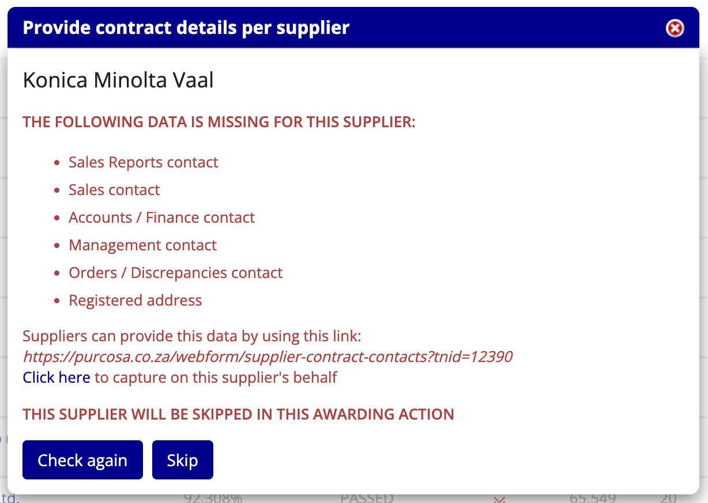
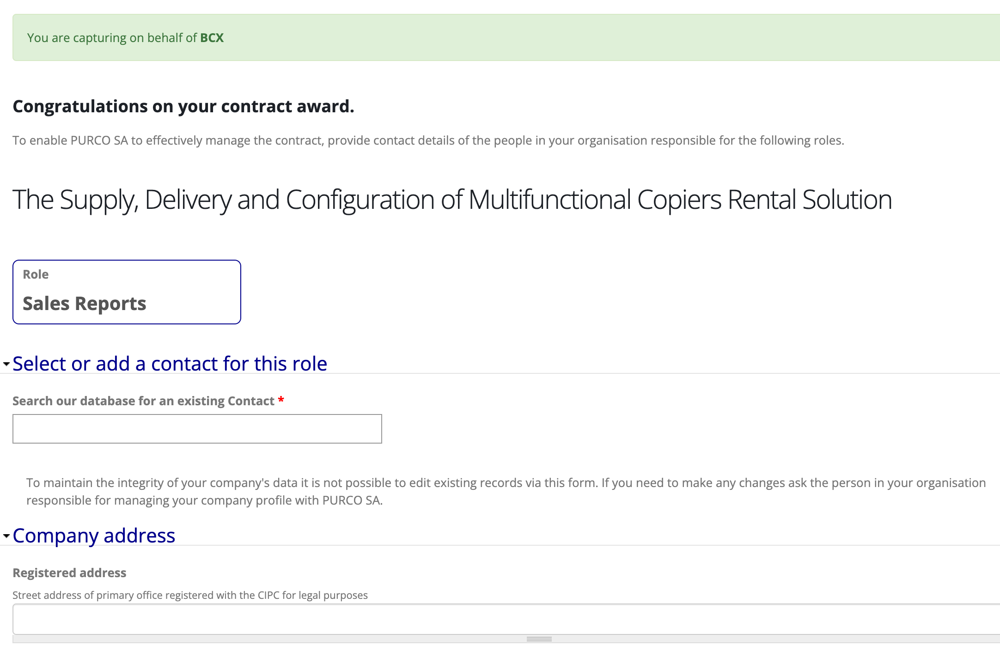
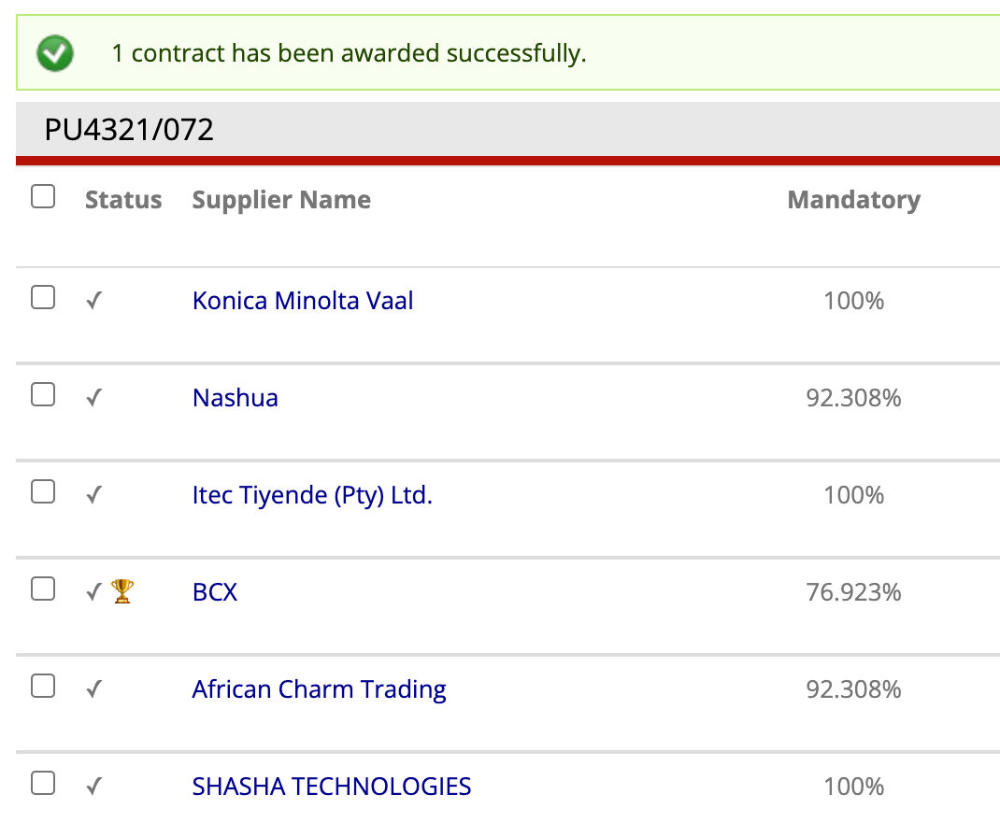

# Awarding Contracts

## Accessing the Contract Awarding Tool

Contract awarding is done from the **Bid Assessment** page of the relevant TenderBox.
The **Bid Assessment** page can be accessed in various ways:

### Via the Tender Dashboard

1. Navigate to the Tender Dashboard for the relevant tender (see [Accessing a Tender's Dashboard](../tenders/tender-dashboard.md/#accessing-a-tenders-dashboard)).

2. In the Tenderbox Dashboard, select the TenderBox tab.

    

3. Click "Assess bids"

    

4. In the Tenderbox Dashboard, select the TenderBox tab.

    

5. Click "Assess bids"

    

### Via the BidSubmissions list

1. In the **ADMIN** menu, select **BidSubmissions - view & assess** in the **TenderBoxes** sub-menu.

    

2. To easily find a specific TenderBox, type all or part of the tender number or name in the **Tender Name/Number** input box.

    

3. Click the "View & assess bids" link for the desired tender in the column on the right.

    

---

## How to Award Contracts

Once on the **Bid Assessment** page for the relevant TenderBox, you can select one or more winning suppliers to award contracts to.

1. Check the checkbox on the left hand side of the list of bid submissions for each supplier that you need to award a contract to. 

    

2. Click the **Award contracts** button on the right hand side above the list of bid submissions.

    

You will now be presented with a popup form that will allow you to provide contract details for each selected supplier in turn. See below for further instructions.

---

## Providing Contract Details Per Supplier

During the contract awarding process, you will need to provide the required contract details for each winning supplier selected:

- **Contract Start Date**
- **Contract End Date**
- **Contract Value**

In addition, the selected supplier records also need to have:

- Contacts employed by the supplier assigned to each one of the following roles for this particular contract:

    - **Sales Reports**
    - **Sales**
    - **Accounts / Finance**
    - **Management**
    - **Orders / Discrepencies**

- A registered physical address captured on the system

Ideally winning suppliers should receive their **Supplier Contract Contacts Form** link via email (when they are informed of their success) which will lead them to the form used for capturing their relevant contacts and registered address.

- This link is provided in the [Tender Dashboard - Awarded Contracts Tab](../tenders/tender-dashboard.md/#awarded-contracts-tab) to be manually copy-pasted if needed.
- This link is to be used by suppliers (not staff members), and more specifically, to be used while logged in to the same account that was used for the tender purchase and bid submission.

However, the system does allow for a staff user to capture these details on behalf of the organisation during the contract awarding process if needed or preferred.

Below are the steps for capturing the required information per supplier (including the supplier's contract contacts if necessary), and completing the contract awarding process. 

### The Contract Details Popup Form

After winning bids have been selected and the **Award contracts** button is clicked, you will be presented with a popup form which will deal with each selected supplier in turn.

The below image demonstrates the scenario where the selected supplier's record is lacking all 5 required contract contacts as well as a registered address.

- Each missing entity required before the contract can be awarded is listed
- The **Supplier Contract Contacts Form** link (in italics) is displayed for the staff member to manually copy and send through to the supplier if needed.
- The "Click here" link is to be used if the staff user will be capturing on behalf of the supplier now.
- The **Skip** button can be used to skip this supplier and proceed with the next supplier selected for this contract awarding process.

Upon clicking the "Click here" link a new tab will be opened containing the form for capturing the first of the supplier's required contract contacts.

### Capturing Supplier Contract Contacts

- The message in green at the top of the page confirms that you are now acting on behalf of the specified supplier.
- The role block indicates which role you are currently assigning a contact to.

1. In the block provided, type the name of the contact to assign to the role in order to check whether their record already exists on the system.

    

2. If the contact is not found, click "NOT FOUND? Click to create a new record"

    

3. Enter the details of the new contact in the fields provided.

4. If the **Registered address** field is empty or contains an incorrect address, enter in the correct address.

    

5. Click **Submit**

    

6. You can now select or add the contact for the next role, specified in the role block.

    
    
    - If you previously added a new contact, that contact will now be available to select when searching, making it an easy process to assign the same contact for multiple roles when appropriate.

        

Repeat the steps to capture all of the supplier's contract contacts.

Once complete you will see a confirmation message, including links for each role provided in case changes are needed.

The supplier themselves is also able to make changes at any point (even after contract creation) by using the supplier link while logged in to the same account used for the bid submission.

You can now switch back to the previous tab and click **Check again** for the system to revalidate the supplier's record.

### Capturing Contract Details

Provided the supplier's contract contacts were captured, as well as the supplier's registered address, the popup will present a form to capture the **Contract Start Date** and **Contract End Date**, as well as the **Contract Value**.

1. You may manually enter the dates in the specified format, or alternatively select the dates through the popup calendar.

    

2. Capture the contract value by entering the amount only, without spaces. Exclude the currency symbol and use a full stop as the decimal separator if needed.

    

3. In this case we have one more supplier that we've selected to award a contract to, click **Next** and repeat the process for the next supplier that was selected.

    

## Completing the Process

4. We are now dealing with the last supplier selected, by skipping this one the system will proceed with the generation of the contracts for those chosen suppliers who were not skipped.
The button label reflects this and indicates the number of contracts that will be created once it is clicked.

    

5. After confirming the awarding of the contracts, the contracts will be generated and the success of the process reflected in the page:

    

    - A message above the list of bids will display the number of contracts successfully created
    - You will see a trophy icon in the status column for each supplier who now has an existing contract record for this tender.

That completes the process of awarding contracts. This process can be repeated for additional winners as needed.

- The created contracts can now be viewed and exported (see [Viewing & Exporting Contracts](./viewing-contracts.md))
- Contract documents can now be uploaded (see [Contract Document Management](./managing-contract-documents.md))
- Merged documents such as Finance LOAs are now downloadable.

---

## Emails Generated

When contracts are awarded through this process two emails are created.

- A draft **Tender Winners Mailing** is created for this tender.
- An email is sent immediately to the following contacts informing them that contracts have been awarded.

    - The Contract Manager: A link to the Tender Dashboard Awarded Contracts tab is included.
    - The Contract Administrator: A link to the Tender Dashboard Awarded Contracts tab is included.
    - The Finance Administrator: A link is provided to the Finance Admin's contract list for this tender, for easy access to LOAs.

---

