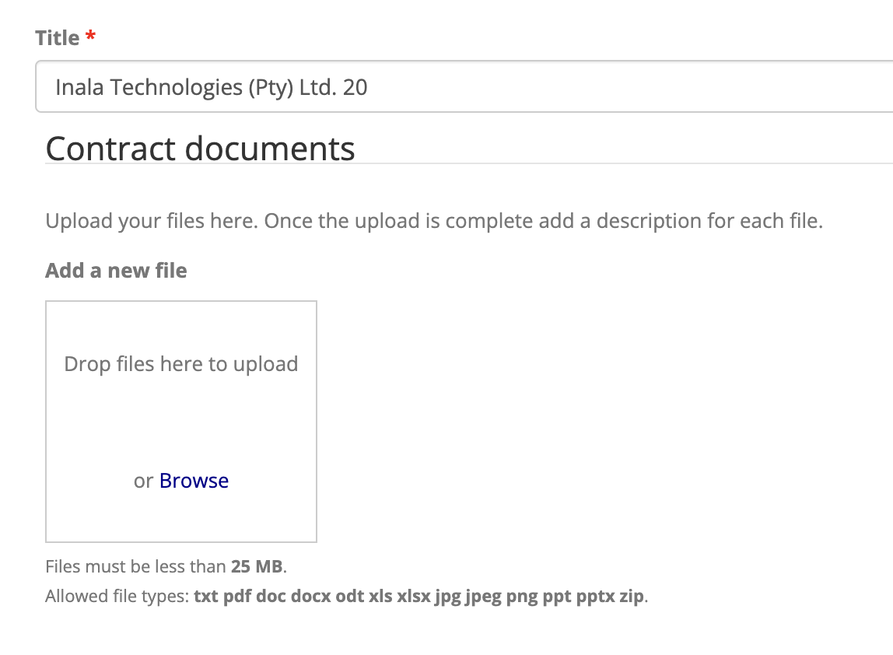

# Contract Document Management

## Uploading Contract Documents

1. Access the contracts list:

    - For a (filterable) list of all contracts, navigate to the **ADMIN** menu, and click **Upload contract documents** in the **Contracts** sub-menu.

        

    - A list of contracts specific to a particularly tender can be accessed via the **View contracts** link available in the **Awarded Contracts tab** of the **Tender Dashboard**, see [Tender Dashboard - Awarded Contracts Tab](../tenders/tender-dashboard.md/#awarded-contracts-tab).

2. If viewing all contracts, use the filters at the top of the page if necessary to find the contract you wish to upload contract documents for.

3. Once you have found the contract in the list, find the link in the column furthest to the right.

    - Click the "Upload documents" link which will be available if no contract documents have yet been uploaded for the contract.
        
        

    - If contract documents have previously been added, use the provided "Edit" link.

        

    
4. Drag and drop the relevant files into the box provided, or click "Browse" to select files.

    

5. Once files have been uploaded, optionally add a description for each file.

    

6. The **Download all files** section should be left as is.

7. Ensure that you click **Save** after you have added the files.

---

## Viewing Contract Documents

1. Follow the instructions above to access a contract list featuring the relevant contract.

2. Click the "View" link provided when contract documents have previously been uploaded.

    

3. Click on a listed document in order to download it. Alternatively, when available use the link at the bottom of the page to download a Zip file containing all documents for this contract.

---

## Removing Contract Documents

1. Follow the instructions at the top of this page to access a contract list featuring the relevant contract.

2. Click the "Edit" link provided when contract documents exist for the contract.
    
    

3. Use the corresponding "Remove" button in order to remove a document from the list.

    

4. Click **Save** after you are done making changes.

---