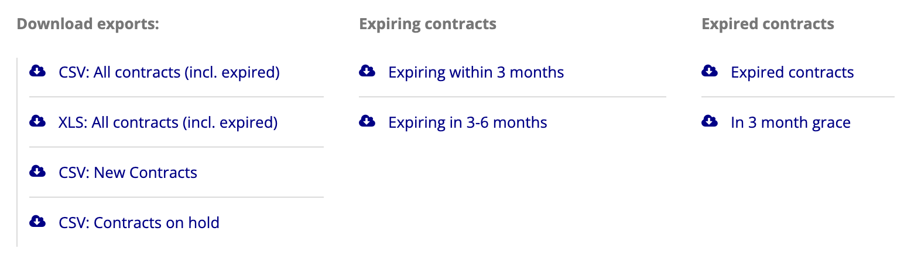
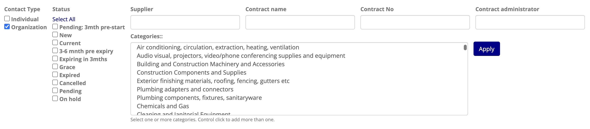
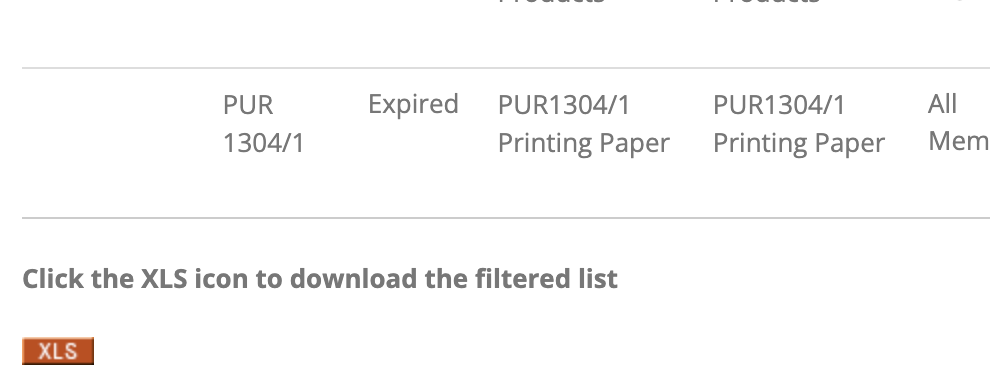

# Viewing & Exporting Contracts

## Accessing the Contract List

In the **ADMIN** menu, click **All contracts** in the **Contracts** sub-menu.

## Quick Contract Exports

Links are provided at the top of the page for quick exports of various types.

## Filtering the Contract List

To list only contracts matching certain criteria, use one or more of the available filters and click **Apply**.

**NOTE:** Filters requiring text input will match contracts that contain the provided text for the specified field, i.e. you may provide only part of the Supplier name (for example) without needing to type the complete name.

## Filtered Contract Exports

Once you have filtered the list of contracts appropriately, click the **XLS** to download an export of only the filtered list of contracts.

