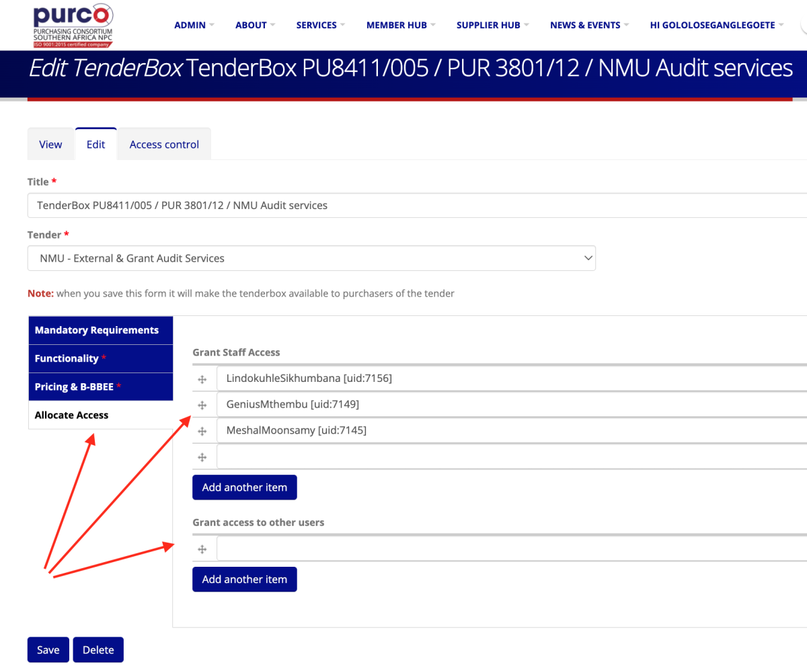
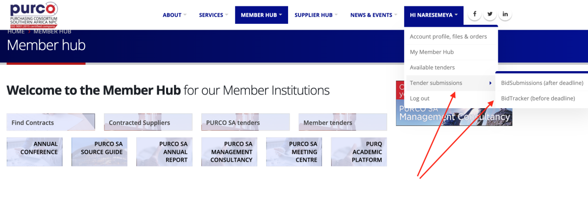
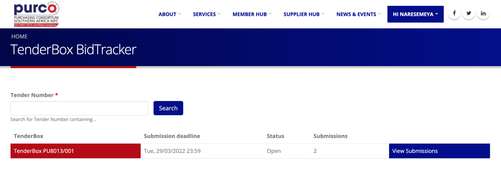
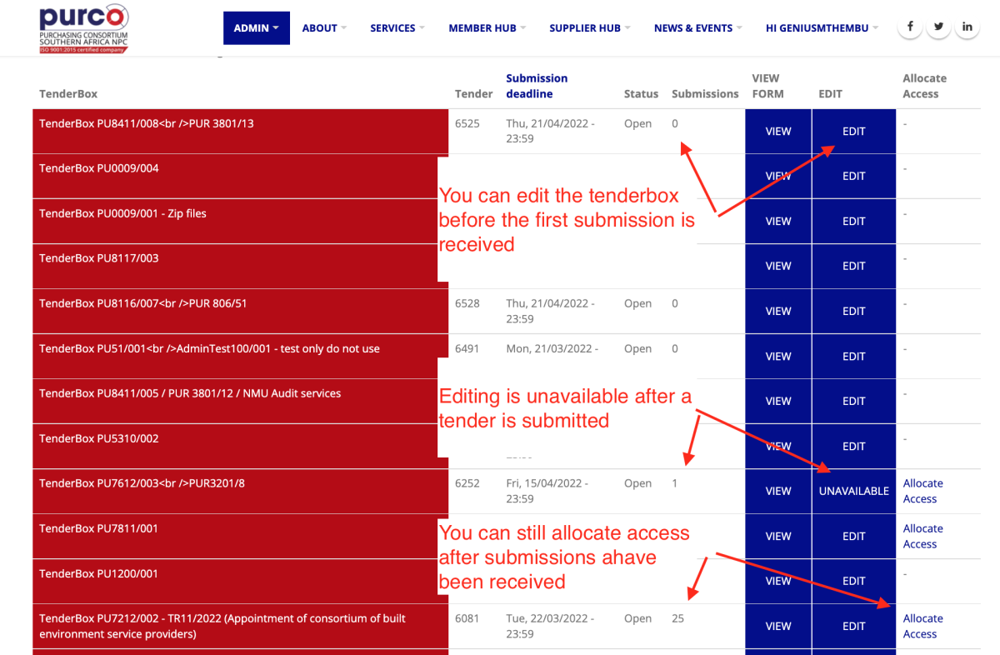

# Allocating TenderBox access

## Allocating TenderBox access to other users

Access to tenderbox submissions is strictly controlled. The default is that only system administrators and the author of a tender can access submissions.

However, the tenderbox system allows you to grant access to other users who need to see submissions and be part of the tenderbox evaluation process (staff, bid committees, consultants etc).  

You allocate access to the required users on the tenderbox creation/editing page.

## Where do non-staff users find tenders they have access to?

Staff users can access tenders via the Staff Hub or under the Admin menu. Non-staff users don't have access to the Staff Hub or Admin menu so they reach tenders to which they have been granted access via their user menu.

## Preventing changes after submissions are received

We designed the new system to prevent any changes to the structure and fields of a tenderbox as soon as a submission is received. This prevents any risk that later submissions are different and not comparable with those already received.  To achieve this the system disallows any access to the tenderbox editing page. 

## What if you need to grant someone access after submissions have been received?

The system logic locks you out of the tenderbox editing page after the first submission is received. But what if you need to allocate access to a user?
To address this we added new functionality. You will now see an 'Allocate access' link on the Tenderbox list page. The link is only available to users who have already been granted access to the tender, thereby preventing any changes by any unauthorised users.

 