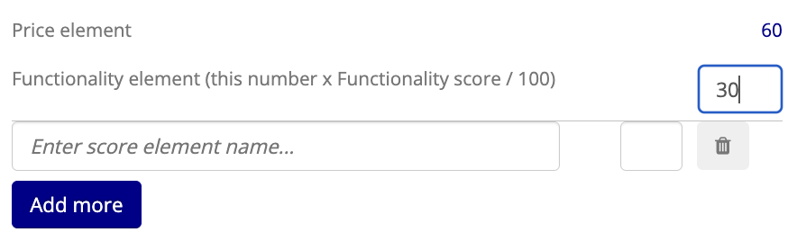
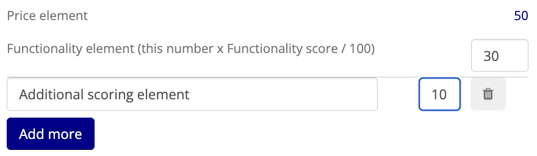
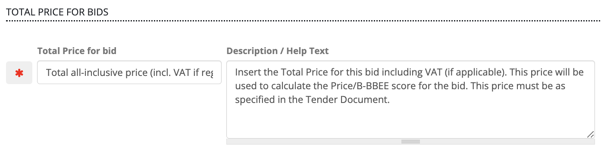
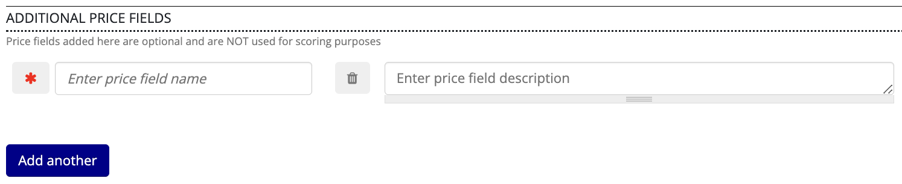
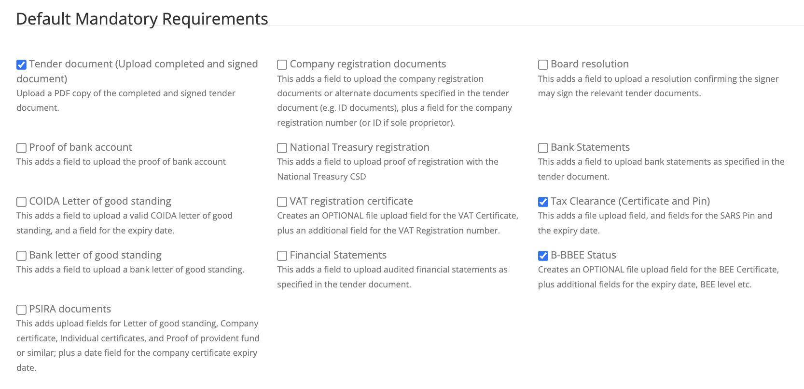
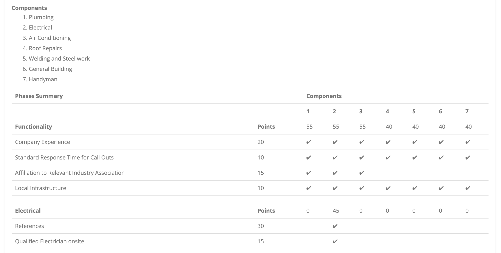
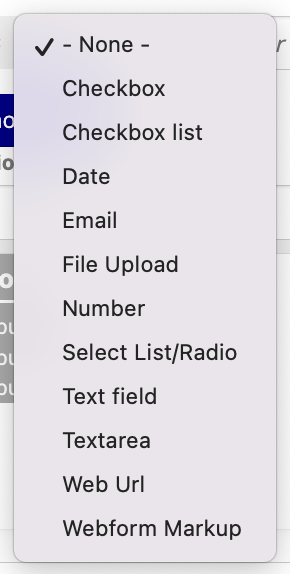
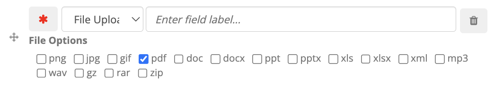

# Creating a TenderBox

## Accessing the TenderBox Creator for a Tender

1. In the **ADMIN** menu select **Create TenderBox** from the **TenderBoxes** sub-menu.

    

    This page will list Tenders that you have authored which are enabled for online submission and do not yet have a TenderBox set up.

2. If helpful, you can filter the list of Tenders displayed by typing all or part of the Tender Number.

    

3. Once you have located the correct Tender in the list, click "Create Multi-Tenderbox" on the right hand side.

    

---

## Setting the Title and Description

1. By default the TenderBox title is based on the Tender's title, this can be adjusted as needed.

    

2. Below the title a rich text field is provided where introduction text can optionally be provided.

---

## Configuring Components

1. By default Components are **not** 'required', a Component should only be set as required when it is compulsory for all bidders and not a Component that should be optionally selectable. To require a Component, click the button with the asterisk icon, a red asterisk indicates that it is set as required.

    

2. Enter a name for the Component.

    

3. Optionally add a short description for the Component.

    

4. Configure Price and B-BEE evaluation. By default "Include Price and B-BEE evaluation for this component" is selected. Disable this if Price and B-BEE evaluation is not applicable for this Component.

    

    When enabled the configuration options discussed below are provided.

    ### Pricing Formula

    By default "Based on lowest price" is selected as the formula to be used. When applicable click the "Based on highest offer (Sale and letting of assets)" option in order to use the formula that favours higher offers rather than lower prices.

    

    ### Preference Point System

    By default the 80:20 system is selected, this means that of a final score out of 100 points, 20 of those points will be determined by the bidder's B-BEE scorecard. Selecting 90:10 will mean that 10 points will be assigned based on the B-BEE scorecard. The last option excludes B-BEE points, leaving 100 points for the "price element" which in all cases can be further customised in a later step.

    

    ### Functionality Pass Type

    By default "Pass each phase" is selected. This means that when multiple functionality phases are included for this component, the bidder should pass each one in order to qualify for the following one. Alternatively, a pass can be determined based on the bidder's average score (%) across all functionality phases. In this case select "Minimum combines score" and provide the value for the passing percentage.

    

    ### Customised Scoring Elements

    By default, 80, 90, or 100 (depending on the selected **Preference Point System**) of the final 100 points will be determined by the bidder's pricing score (the result of applying the selected **Pricing Formula** to that bidder's price / offer). This element can be further customised however.

    - **Adding a functionality element:**
        By setting a number for the value of the functionality element, the specified number of points will be allocated to the bidder's functionality score. (If the value for the functionality element is 10 and the bidder scored 70% for functionality, they would then be awarded 7 of the 10 points.)
            
        

        You will notice that the points that remain for the price element are automatically updated based on the value provided.

        

    - **Adding a custom element:**
        A custom element can be added by entering a name and assigning a value for it. When assessing submissions for this TenderBox, a field will be provided for the manual capture of the bidder's score for this custom element.

        

        As with the functionality element, you will notice the price element value automatically adjusts:

        

        Click the "Add more" button if you need to add more custom elements.

        

    ### Additional Points

    Additional points can be configured if necessary. These points are **in addition** to the 100 total points. Add an additional points element by entering a name for it and assigning a value.

    

    As usual, click "Add another" to add more additional points elements.

    ### Price Fields

    

    By default the total price field is set as 'required' (indicated by the red asterisk), meaning the bidder will not be able to make a final submission without providing a total price. The label and description for the total price field can be adjusted here if necessary.

    ### Price File Upload Field

    The TenderBox can be configured to include file upload fields for more detailed pricing schedules. Enabling this will ensure the inclusion of two upload fields: One accepting a .xlsx (excel spreadsheet) file and the other accepting a PDF document.

    

    You are able to set these upload fields as required / optional, as well as specify a label and description to be used.

    

    ### Additional Price Fields

    

    Here you can provide names and descriptions for additional price fields to be included in the TenderBox, as well as set whether each one is required or optional. Note that values provided by bidders for these fields are not used in any way by the scoring system.

5. Allocate access to relevant users.

    

    Two access lists can be configured:

    - View & Assess: bidders included in this list will be able to view submitted data and files as well as assess and score for this component.
    - View: bidders included in this list will be able to view submitted data and files for this component, but will not be able to assess or score.

    Begin typing the username of the user who you wish to add to the relevant access list and select them from the dropdown:

    

    Use the "Add another" buttons in order to add additional bidders to each list.

6. Add additional Components as needed and repeat the above steps.

    To add another Component to this TenderBox, click the red "Add another component" button available at the bottom of the Components form:

    

---

## Configuring Mandatory Requirements

Select the **Mandatory** tab to set up the Mandatory Requirements for the TenderBox.

### Default Mandatory Requirements

Select which of the Default Mandatory Requirements presented should be included in this TenderBox. The requirements selected here will be included in the form provided for bidders regardless of which component/s are selected.
It is important to make use of these rather than to create custom Mandatory Requirement Sets to serve the same purpose. The "B-BBEE Status" requirement here for example, will ensure that B-BBEE information captured from the bidder is added to their organisation record in the CRM system, and even more importantly, usable by the scoring system when a component is configured to consider B-BBEE Level.

### Custom Mandatory Requirements

We will now follow the process of adding custom Mandatory Requirements to this TenderBox.
As with Functionality Requirements, each requirement can be configured to include multiple different form fields (a file upload field, a text field, checkboxes, etc.)
Each requirement "set" as a whole (not the included fields individually) can be assigned to multiple different components, and will be validated as a whole during the assessment process.

1. Click the grey input box of the first Mandatory Requirement Set to activate it in the form.

    

2. Enter a name for this requirement.

3. On the right hand side of the screen, configure the fields to be included for this requirement. See [Field Types and Options](./creating-a-tenderbox.md#field-types-and-options) for more information.

    1. Select the field type for this field and configure any additional settings the field type provides.

        

    2. Enter a label for the field.
    3. Fields are set as "required" by default, toggle this off by clicking the red asterisk if the field should be optional.
    4. Click the "Add another field" button to add another field, repeat the steps as necessary.

        

4. Optionally enter **Description / help text** for this requirement in the input provided.

5. In the grey **Components** box, a checkbox is provided next to the name that has been set for each component. Deselect the components that should **not** include this requirement.

    

6. Click the "Add another Requirement" button and repeat the steps the above steps as necessary for each Mandatory Requirement.

    

---

## Configuring Phases & Functionality Requirements

Select the "Phases and Functionality Requirements" tab to configure one or more phases and set up the Functionality Requirements for each of these.

- **Phase name:**
    Provide a name for the phase.

    

- **Functionality passing score:**
    Set the value of the minimum percentage required in order for a bidder to pass this phase.

- **Contribution to combined functionality passing score:**
    Set this when requirements defined in this Phase are to be assigned to components which are configured to use a combined pass. The number provided represents the contribution of this Phase towards the combined total Functionality score. The sum of the contributions of Phases involved in a component configured with a combined pass should add up to 100.

    

- **Contribution to customised price functionality score:**
    When requirements defined in this Phase are to be assigned to components which are configured to include a Functionality scoring element, the value provided here determines the contribution of this Phase's score towards the total Functionality score that is then used to determine points awarded for the Functionality element of the total score. The sum of the contributions of Phases involved in a component configured with a Functionality scoring element should add up to 100.

    

- **Internal use only:**
    Check this checkbox for Phases that are purely internal, this means that the Phase and all requirements and fields that are part of it will be excluded from the TenderBox form that bidders will use. After the submission deadline, staff with "View & Assess" access to submissions will have this Phase and its requirements and fields available during the assessment of bids.

    

### Customer Reference Sets

Each Customer Reference Set can be configured to accept any number of customer references.
According to the requirements for the Tender, multiple sets may be preferable based on:

- Different types/categories of customer references required
- Component assignment (each set can be assigned to different components)
- Scoring & validation (scoring and validation happens on a per set basis, individual customer references within a set cannot be marked as valid/invalid separately)

Follow these steps to set up Customer Reference Sets:

1. Click the grey Custom Reference Set input box to activate it in the form.

    

2. Enter a name for the set in this input box.

3. On the right hand side, multiple customer references can be added to this set.

    1. Enter a label for this customer reference.

        

    2. Individual customer references are set as "required" by default, toggle this off by clicking the red asterisk to make this customer reference optional.
    3. Click the "add another customer reference" button and repeat the steps for each customer reference required.

        

4. By default, the inclusion of both a file upload field and information fields is enabled. Toggle these checkboxes as desired.

    - **Include upload field for the customer reference letter**

        A file upload field will be provided for each customer reference in this set.

        

    - **Include text fields for name, company, job title, contact and contract details**
    
        Numerous fields will be included for the capturing of details for each reference in this set.

        
        
5. Configure the score for this set (see [Fieldset Scoring Configuration](./creating-a-tenderbox.md/#fieldset-scoring-configuration) for more information).

6. In the grey **Components** box, a checkbox is provided next to the name that has been set for each component. Deselect the components that should **not** include this Customer Reference Set.

    

7. Click the "Add another reference set" button and repeat the above steps to configure additional Customer Reference Sets if needed.

    
    
---

## Reviewing the Scoring Summary

Switch over to the "Scoring Summary" tab to see an overview of the TenderBox's scoring configuration as you build it.

At the top of the Scoring Summary the names of the Components are listed alongside their Component numbers.
Below that, a table is displayed which includes a row for every Functionality Requirement Set, sectioned according to the Phase they belong to. On the right hand side a column is provided for each Component.

In this screenshot the first Phase (named "Functionality") and second Phase (named "Electrical") of this TenderBox are shown.
A tick in a Component column indicates that the requirement is included for that Component.
Here we can see that the third requirement of the first Phase ("Affiliation to Relevant Industry Association") is included for only the first 3 Components. The second Phase ("Electrical") has been set up specifically for Component 2 which shares the same name, we can see these requirements are only assigned to Component 2.
The column to the right of each requirement name shows the assigned points value. In the header row of each Phase, the Component columns display the total number of points that the Phase holds for each Component.

By referring to the Scoring Summary one can easily verify multiple aspects of the scoring configuration at a quick glance.

---

## Generating the TenderBox

It is important to note that nothing in the TenderBox Creation form is saved until such point as the "Save" button at the bottom of the page is clicked.

Upon saving, the TenderBox itself is generated based on the provided configuration. You will be redirected to the TenderBox form itself in order to verify the final result.

---

## Field Types and Options

When adding a field to a Mandatory or Functionality Requirement set, multiple field types are available to select from. These are listed below:

- **Checkbox**  
  A single checkbox that allows bidders to confirm a yes or no statement.

- **Checkbox list**  
  A group of checkboxes allowing bidders to select multiple options from a list.

    - When selected, an additional input is provided in order to specify the various options in a comma-separated list.

        

- **Date**  
  A field for selecting a date.

- **Email**  
  A field specifically for entering a valid email address.

- **File Upload**  
  A field that allows bidders to upload a file.

    - When selected, checkboxes are provided in order to specify which file types should be accepted.

        

- **Number**  
  A field for entering numeric values only.

- **Select List/Radio**  
  A dropdown or a list of radio buttons that lets bidders choose one option from a predefined set.

    - When selected, an additional input is provided in order to specify the various options in a comma-separated list.

        

- **Text Field**  
  A single-line field for entering plain text.

- **Textarea**  
  A multi-line field for entering longer text content.

  - When selected, an additional input is provided to specify placeholder text (text that displays within the text area before the bidder enters anything).
    
    

- **Web URL**  
  A field for entering a valid website URL.

- **Webform Markup**  
  A field type that can be used to add additional text or content to the requirement set

    - When selected, an additional input is provided for supplying the content to be included.

        

In addition to specifying the field type for each field, a name must be entered for the field.
As is the case elsewhere in the TenderBox Creator form, a red asterisk indicates that this field will be "required" - the bidder will need to fill the field in order to be able to make a final submission. Click on the button containing the red asterisk in order to toggle it off, meaning that the field will be optional.

---

## Fieldset Scoring Configuration

For Customer Reference and Functionality Requirement Sets, two options are provided for allocating points.

- **Fixed Score:**
    A fixed score configuration awards the specified number of points to all bidders for that particular set, provided that the data submitted for it has been marked as "Valid" by an assessor. When "Invalid", 0 points are awarded for the set.

    

- **Range Score:**
    When using a range score configuration, a minimum (usually 0) and maximum value must be specified.
    During the assessment phase, staff with the necessary permissions will be presented with an input allowing them to manually specify any value within this range, scoring this set appropriately according to each bidder's submitted data.
    
    

---