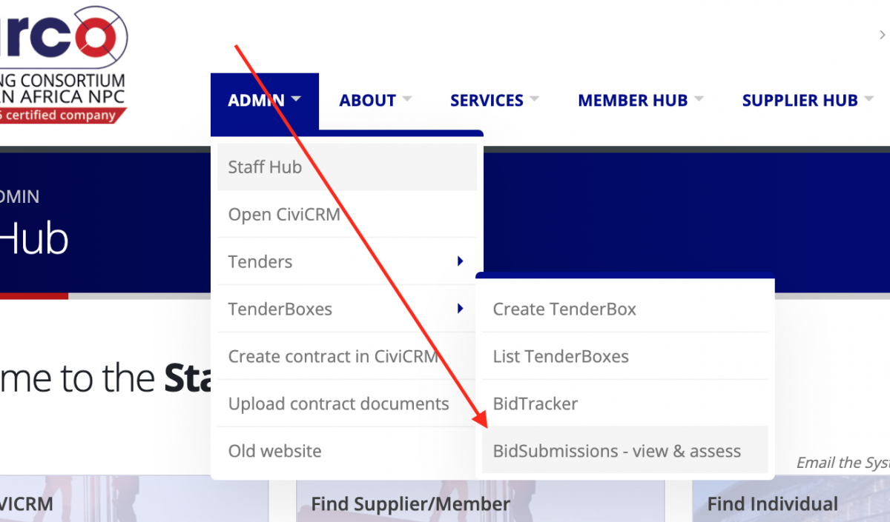
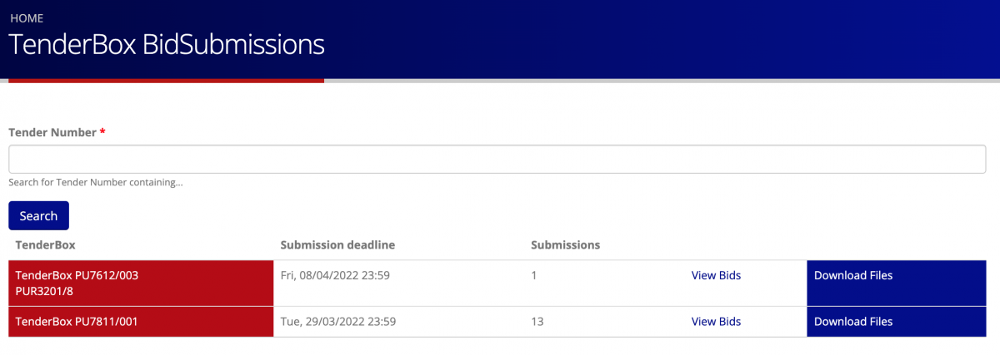
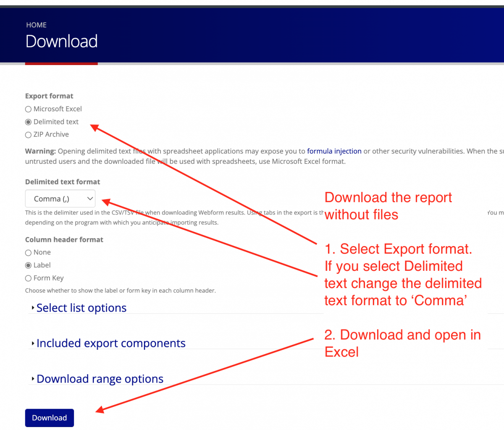
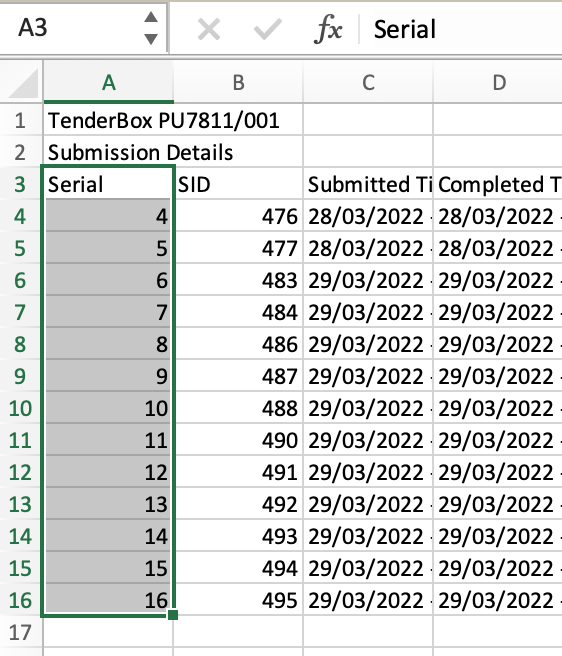
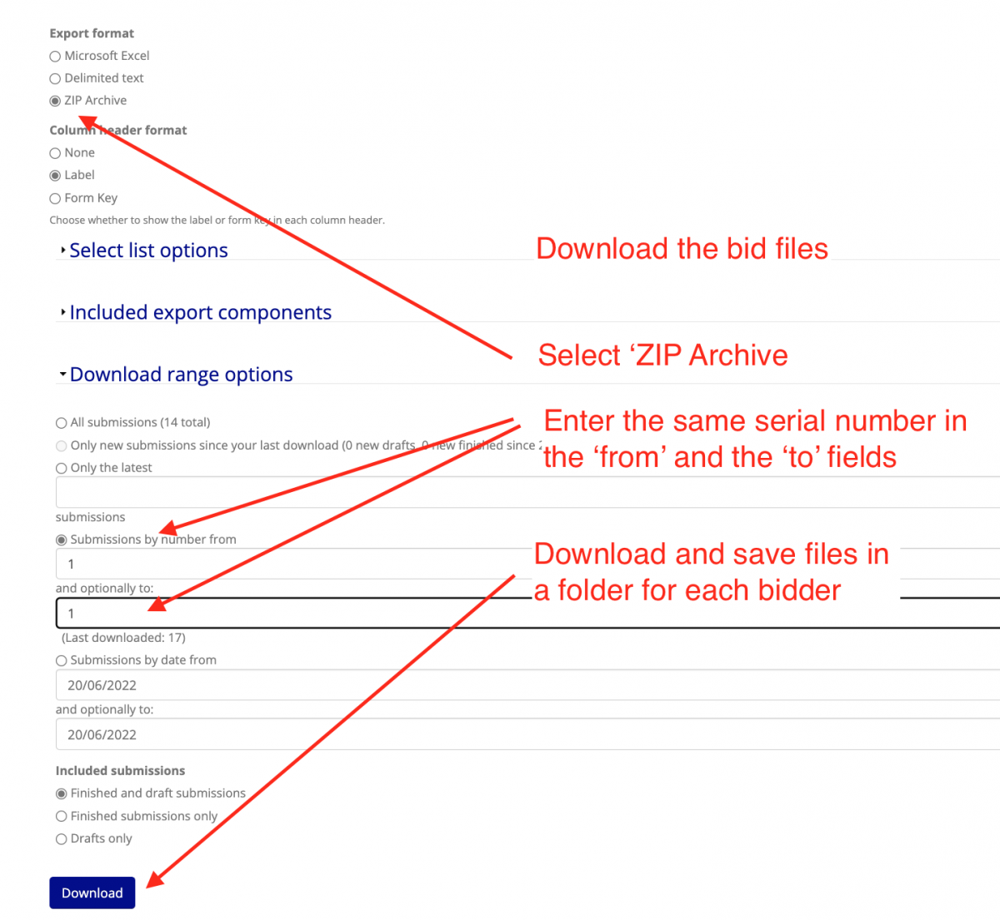

# Downloading submitted TenderBox files

Follow this process to download bid files submitted via an online Tenderbox.

- Log in to the website.
- Go to the BidSubmissions page

- Your Tenderboxes that are past submission deadline will be visible:

- Click on the Download Files link, which will open a download form for the tenderbox.
- Select either Microsoft Excel or Delimited text as the export format. If you select Delimited text change the delimited text format to 'Comma'
- Click on the Download button and save the file.
- Don't close the download page

- Open the downloaded file in Excel and note the serial numbers in the left column.
- Each supplier's submission has its own serial number. 

- Go back to the Download page.
- Check "ZIP archive"
- Click on  'Download range options' to open the concertina
- Enter the same serial number of the submission you want to download in both 'Submissions by number' fields
- Check the 'Finished and Draft Submissions' checkbox. *Some suppliers forget to complete their submissions, but if the submission as saved as a draft the details may all have been uploaded*
- Click Download

- Save the downloaded zip file into a folder for that supplier, and unzip the file to access the bid files.
- REPEAT for each submission.