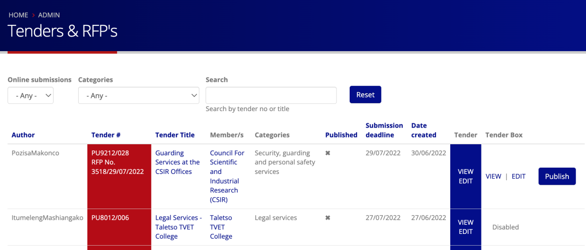

# Publishing and unpublishing TenderBoxes

The standard workflow when creating an online tender is to:

1. Create the tender
2. Create a blank tenderbox so that you can get the URL of the online submission page. 

    *(Sidenote: we recommend not including the tenderbox URL in tender documents. Rather direct bidders to login as the user who purchased the tender and click on the 'My purchased tenders' link)*

3. New tenderboxes will be unpublished by default (bidders won't be able to access them)
4. The author will be able to create a tenderbox and return at any time before the deadline to edit/finalise it, removing the ability for eager bidders to start populating the incomplete tenderbox before it is ready.
5. A tenderbox can be unpublished if necessary e.g. if a problem is identified that needs to be addressed before allowing bidders to continue submissions.
6. When you have finished setting up your tenderboxes and it is checked/approved click on the 'Publish' button to publish it and make the tenderbox available to suppliers.

On the tender listing page [here](https://purcosa.co.za/staff/tenders) there is a column on the right with a button to publish/unpublish the tenderbox

Tenderboxes can also be published/unpublished on the tenderbox page [here](https://purcosa.co.za/staff/tenderboxes)

