# Help a supplier access a TenderBox

We often receive requests from suppliers who don't know how to reach the tenderbox submission page.
There is an explanation on the email they get when they buy the tender and the details should be included in the tender documents, but we recognise people don't always read the instructions.
 
Below is the information about how to help these suppliers:
 
## Short version

- ​The ​Suppliers must log in as the user who purchased the tender.
- The submission link is available on the​ir​ 'My purchased tenders' page
- Links to​ the​ 'My purchased tenders' page are on the Supplier Hub​,​ and under their username​ (see image under #2 below).
 
## The email we send to bidders
 
When suppliers email us asking how to access the tenderbox page we do some research on the system and then send them the following email.

---
Dear **[PERSONS NAME]**
 
In order to submit your tender bid you need to log in to the PURCO SA website using the username of the person who purchased the tender. 
The records indicate the purchaser was **[PURCHASER NAME]** with username **[USERNAME]**
 
You will find the link to submit your bid documents by clicking on the 'My purchased tenders' link on your SUPPLIER HUB page or under your username

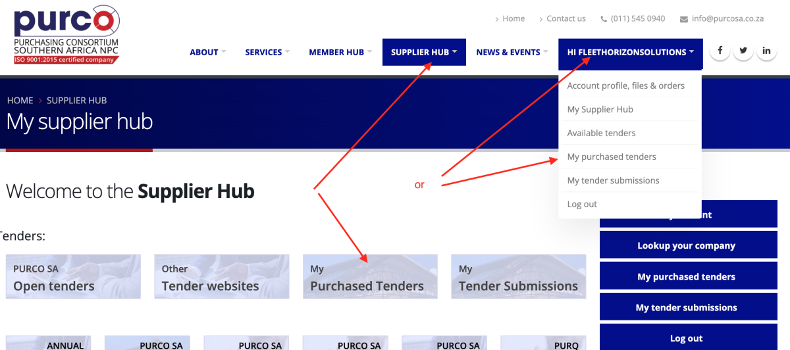
 
​Yours sincerely, etc

---

## How to find the tender buyer's name

- Login

- Open the **Tender purchasers** page.
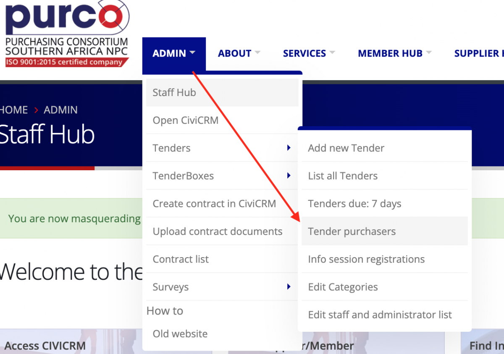

- Find the tender and click on **View** to see the list of purchasers
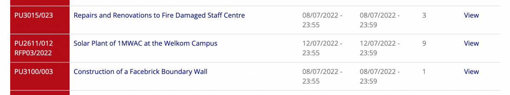

- The buyers table lists the name and contact details of all buyers for the tender.
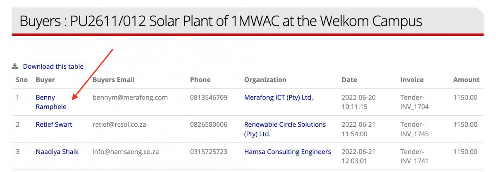

## How to get the buyer's username
- Click on the name of the buyer on the Tender purchasers' page (see above)
- This will open the buyer's CiviCRM record.
- Click on the link to the person's website user record. *If there is only one number here it means the person does not have a website user account*
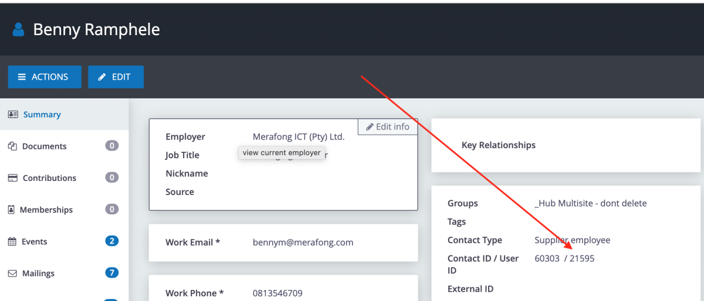
- View the buyer's website user record
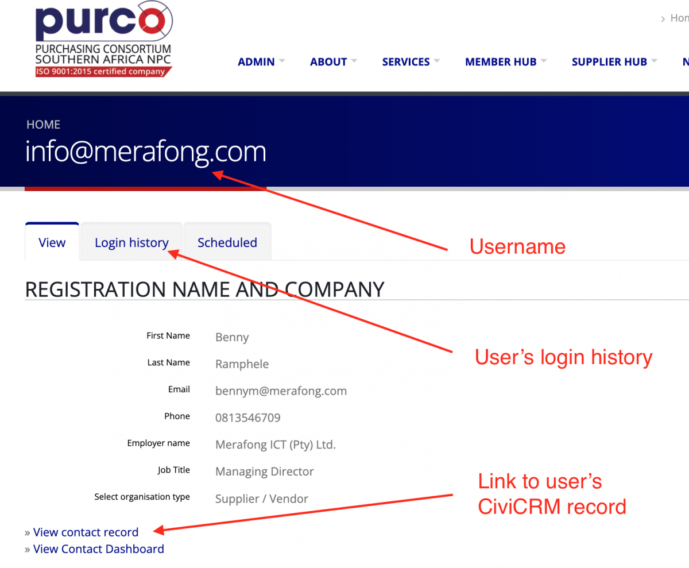

## What to do if the supplier isn't listed on the tender purchasers page
​
​When we first implemented the new system there were some bugs which resulted in some purchases not being captured correctly.
We have manually checked all purchase transactions since the new system went live and corrected these on the system, but there is a chance we might have missed some. 
 
There are two processes to find purchase transactions  that are not listed on the Tender Purchasers page.

### Method 1: Search CiviCRM for all transactions related to the tender (you can do this). 
*If this does not find the transaction then use the second method.*
 
- Login and open **CiviCRM**
- Go to the **Find Activities** page
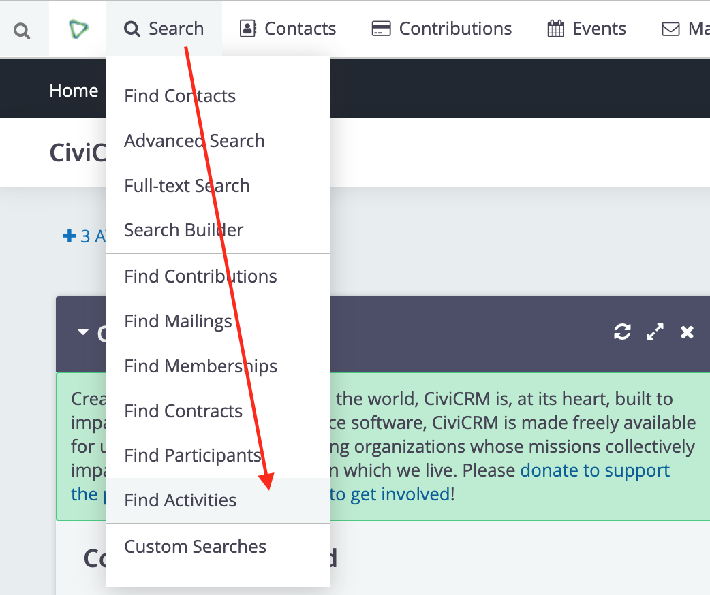
- Search for Activity Type = 'Track CiviCRM tender purchase' and Activity text = the tender number
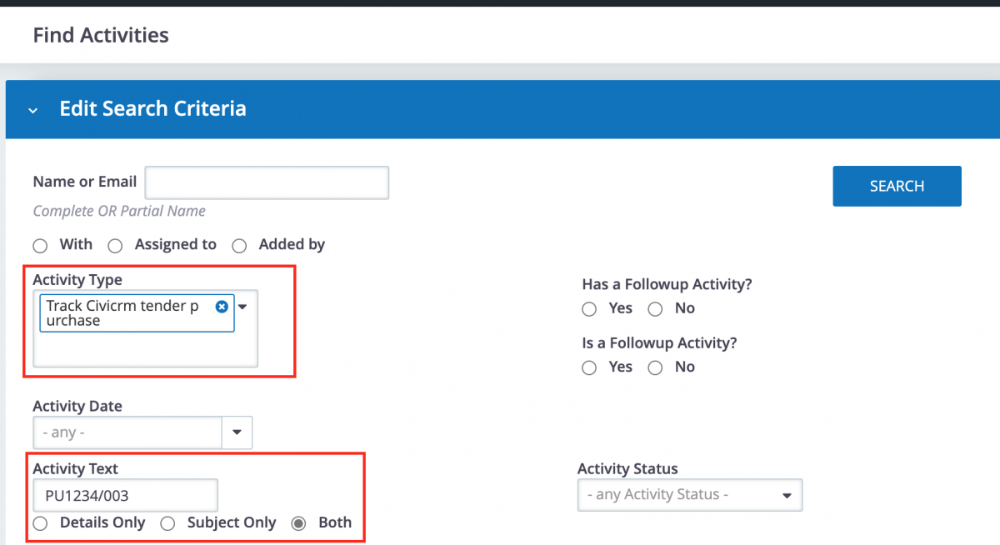
- This will return a list of all contacts and their companies who purchased the tender.
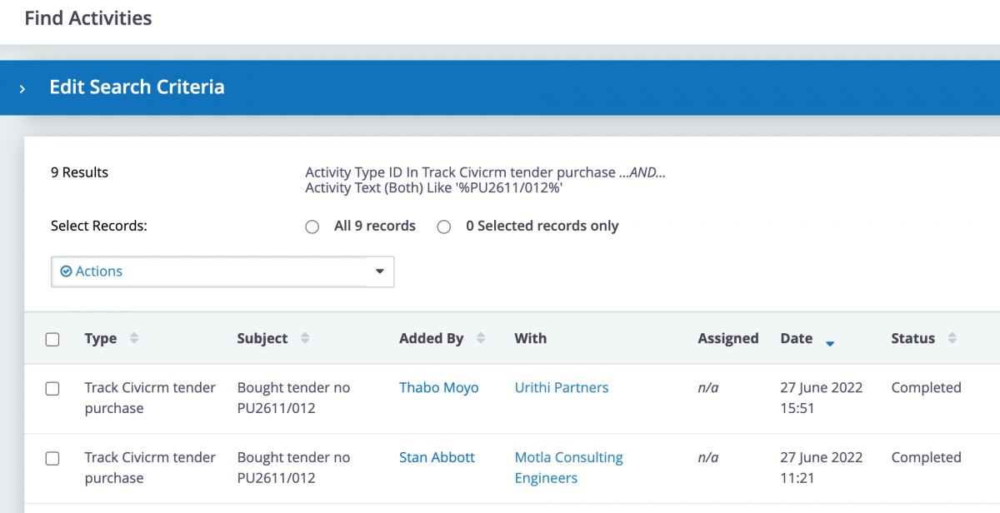
- Click on the company name to open their record, and check their Contributions tab for the transaction
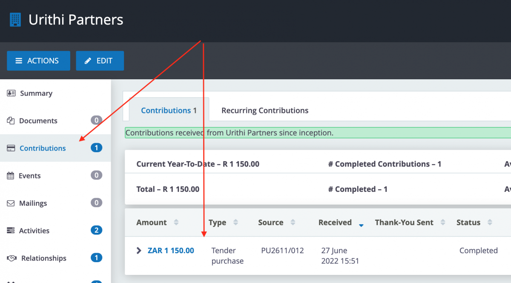 
- If the transaction is not reflected on the company record you can also check the employee's Activity tab
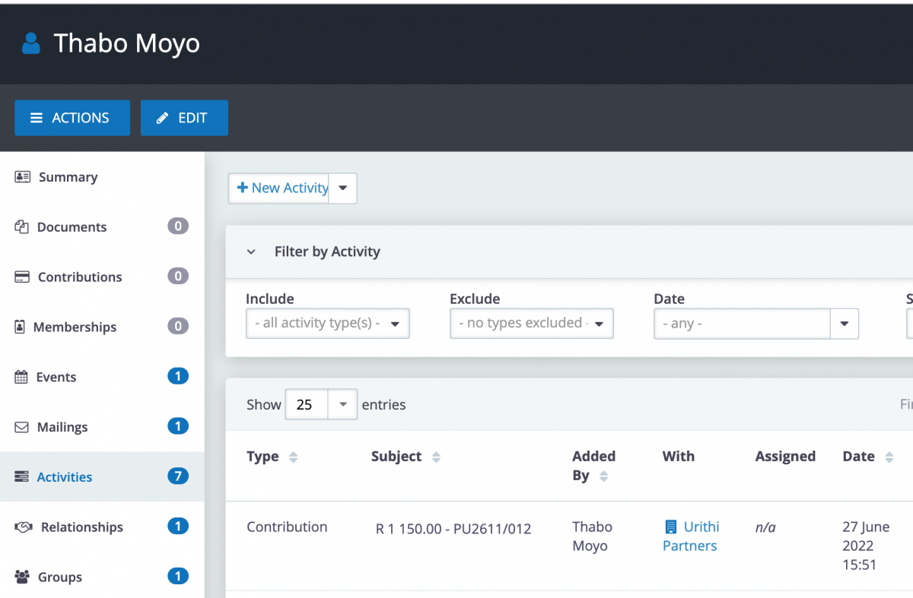
- If the transaction is not reflected on the company's CiviCRM record contact Davy
- Provide the following information:
    - Name and contact details of the supplier who has the problem
    - Tender PU number
    - URL to the supplier's contact record on CiviCRM 
 
### Method 2: Search Payfast for the transaction

- If the CiviCRM process outlined above does not work we can search Payfast for all transactions related to the tender. Pauline and Davy can do this. 
- The search will return details of the person who made the purchase and their email address (not always the person listed in CiviCRM).
- It will also return the transaction Order number.
- Davy or another admin user can use the Order number to find the transaction on the website Orders system.
- The Order system will show details of the transaction and the website user the transaction is associated with.
- If the purchase is not reflected on the user's company record our website developer will edit the database to correct the problem. This will add the transaction to the user's company record and give them access to submit their tender online.