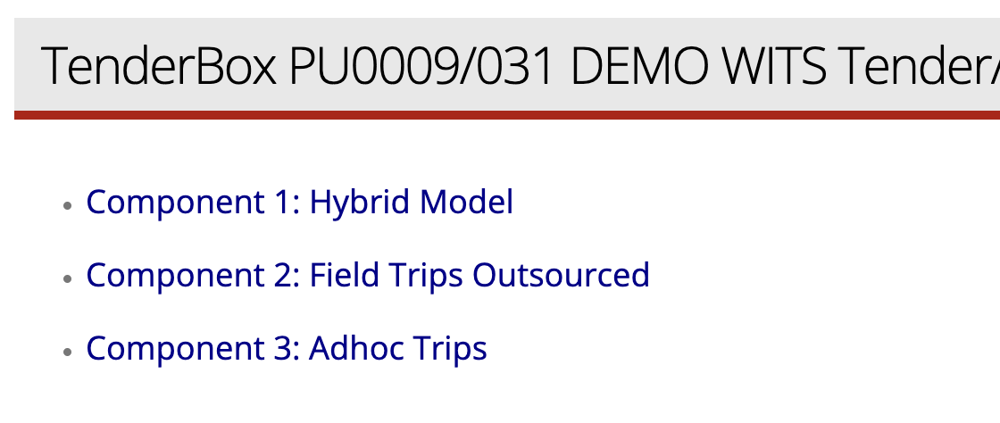
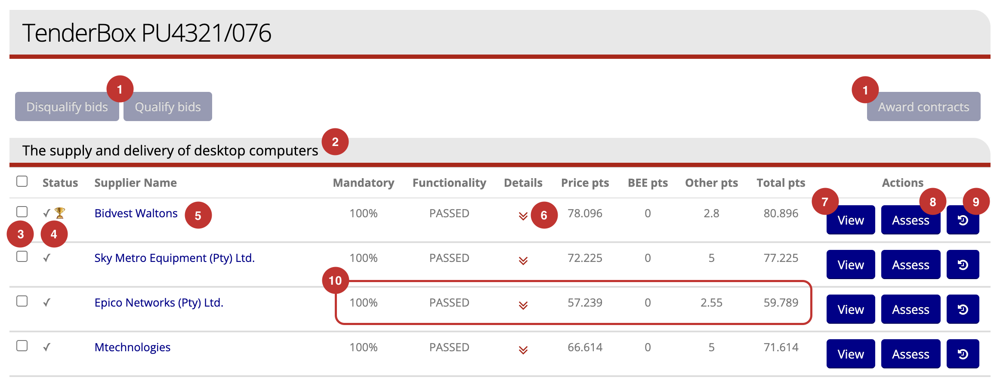
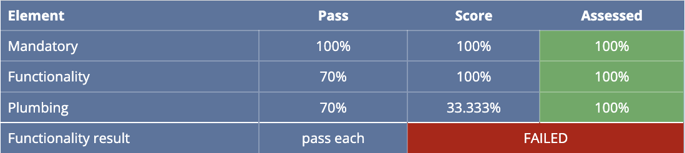
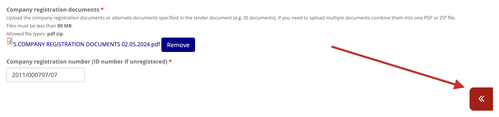
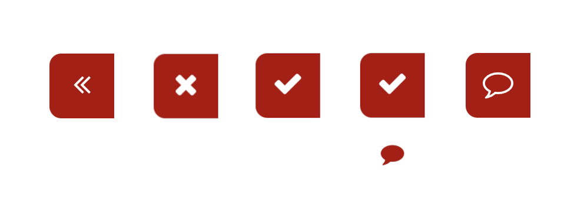
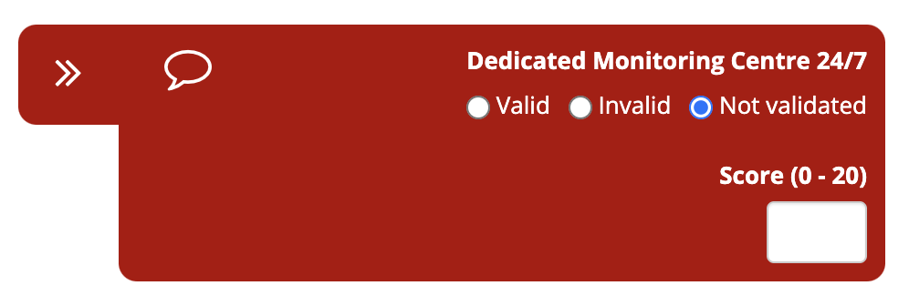
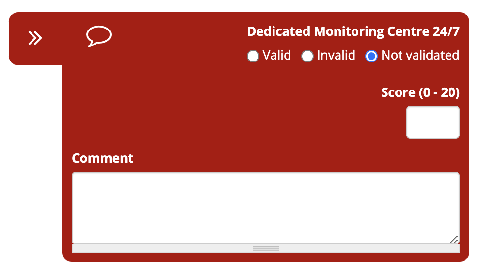

# Viewing & Assessing Bids

## Accessing the Bid Assessment Page

The **Bid Assessment** page can be accessed in various ways:

### Via the Tender Dashboard

1. Navigate to the Tender Dashboard for the relevant tender (see [Accessing a Tender's Dashboard](../tenders/tender-dashboard.md/#accessing-a-tenders-dashboard)).

2. In the Tenderbox Dashboard, select the TenderBox tab.

    

3. Click "Assess bids"

    

### Via the BidSubmissions Page

1. In the **ADMIN** menu, select **BidSubmissions - view & assess** in the **TenderBoxes** sub-menu.

    

2. To easily find a specific TenderBox, type all or part of the tender number or name in the **Tender Name/Number** input box.

    

3. Click the "View & assess bids" link for the desired tender in the column on the right.

    

### Component Selection

In the case of a TenderBox that involved multiple **components**, you will first be presented with a list of those component names, click the component name to access the corresponding **Bid Assessment** page.

---

## Overview of the Bid Assessment Page

1. **Action buttons (Assessors Only)**: These will become enabled when at least one of the bid submissions in the list has been selected by checking the selection checkbox (3), they can be used to **disqualify bids**, **qualify bids**, or **award contracts** (see [Awarding Contracts](../contracts/awarding-contracts.md)).
2. **Component name**: This reflects the component name of the current assessment page.
3. **Selection checkboxes  (Assessors Only)**: Used to select one or more bids in order to execute an action (1) on the selected bids.
4. **Status indicators**: A tick or cross indicates that a certain bid is either qualified or disqualified respectively. A trophy symbol indicates that this bid is a winning bid and a contract has been awarded to the supplier.
5. **Supplier name**: The name of the supplier for a particular bid, this is a clickable link which leads to the relevant supplier's contact record in CiviCRM.
6. **Details toggle**: Clicking this will expand / collapse a more detailed summary of an individual bid's scores.
7. **View button**: Click to view the bid submission.
8. **Assess button  (Assessors Only)**: Click to assess the bid submission.
9. **History button**: Click to view the history of the assessment changes made to this bid submission.
10. **Scoring summary**: These columns provides a summary of the current assessment results for each bid.

### Viewing a Bid's Detailed Scoring Summary

Clicking the **Details toggle** (point 6 above) will expand a colour-coded table containing rows for each of the following:

1. **Mandatory**: The bid's results for the Mandatory phase.
2. **Functionality**: The bid's results for the Functionality phases, of which there may be one or more depending on the particular tender requirements and TenderBox configuration. One row will be included for each existing Functionality phase, labeled with the name of the phase.
3. **Functionality result**: The overall functionality result for this bid.

Each of these rows provide detail for 3 columns:

1. **Pass**: This reflects the percentage required for a pass. For the **Functionality result** row the "pass type" is shown - usually "pass each" which means each functionality phase needs to be passed in order to qualify for the following one.
2. **Score**: The current score that this bid has achieved based on its assessment.
3. **Assessed**: This reflects the progress of the assessment of this bid for this phase. The colour of this table cell will range from black to bright green according to the level of completion.

For the **Functionality result** row, the last table cell spans across both columns (2 and 3 above), and reflects the overall status - **PASSED** (in a green cell) or **FAILED** (in a red cell).

This format allows the viewer to get key insights into the progress and result of the bid's assessment across all phases with a quick glance.

---

## Viewing a Bid Submission

Click the "View" button provided in each submission row to view that particular submission.

### Viewing & Downloading Files

To view or download an uploaded file click or right-click on the filename. (Your web browser settings can be changed to either automatically download files or open them within the browser.)

### Validation Status

The green 'Valid' indicates that the requirement was marked valid during the bid assessment.

### Comments

Any comments that have been added by assessors are displayed beneath the validation status for each requirement.

### Scores

Below the comments section the awarded score is displayed (when applicable for the requirement).

In the above example "(0 - 25)" indicates that this is a **range score**, with 25 being the maximum score achievable.

### Pricing

The bidder's price appears last within the pricing section. 

Note: the 'Revised total' field is an internal field used by the bid committee to enter a different price. This is only to be used in the event that the bidder made an error when entering their price (e.g. the bidder entered a VAT exclusive price or made a typing error). The original price cannot be changed, but in the case of a TenderBox configured for price-based scoring, the system will make use of the 'Revised price' (when provided) for scoring calculations.

### Scoring Table

At the bottom of each bid submission is a scoring table. 

The table shows:

- Scores achieved
- Assessment completion percentages
- Pass / fail statuses 

The table is colour-coded, making it possible to see details of assessment progress and the bid's performance at a glance.

---

## Assessing a Bid Submission

Click the "Assess" button in the right hand column of the relevant bid in the [Bid Assessment Page](./viewing-and-assessing-bids.md#overview-of-the-bid-assessment-page) in order to assess the bid.

### Validator Tabs

At the bottom right of each requirement in the TenderBox submission you will see a red tab.

These tabs may appear in the following variations (left to right in the image below):

1. This requirement has not yet been validated
2. This requirement has been marked as "Invalid"
3. This requirement has been marked as "Valid"
4. This requirement has been marked as "Valid" and contains a comment
5. Validation not applicable, this card can only be used for commenting

### Validating, Scoring & Commenting

Click on the [validator tab](./viewing-and-assessing-bids.md#validator-tabs) to open the validator card for the requirement you are assessing.

- Select "Valid" or "Invalid" to set the status of the requirement
- Enter the appropriate score in the score input (provided when the requirement is configured for a range score)
- Click the speech bubble icon in order to expand the comment input box if you wish to add a comment:

    

- Clicking the double arrow again will close the validator card again

It is important to note that nothing is saved in this form until the "Save" button at the bottom of the page is clicked.

---

## Viewing a Bid's Assessment History

In the list of bids on the Bid Assessment page, click the button with the history icon in order to view the Assessment History for a particular bid submission.

The Assessment History page lists every field of every requirement within the submission that has been changed since the submission deadline (including validation, comment and score fields). The numbers in the red circles on the right indicate the number of changes made.

Click on a field in order to expand a table detailing the changes made.
Below is an example of two requirements that had changes. The time of the change, the user responsible for the change, and the old and new values of the field are displayed.

---