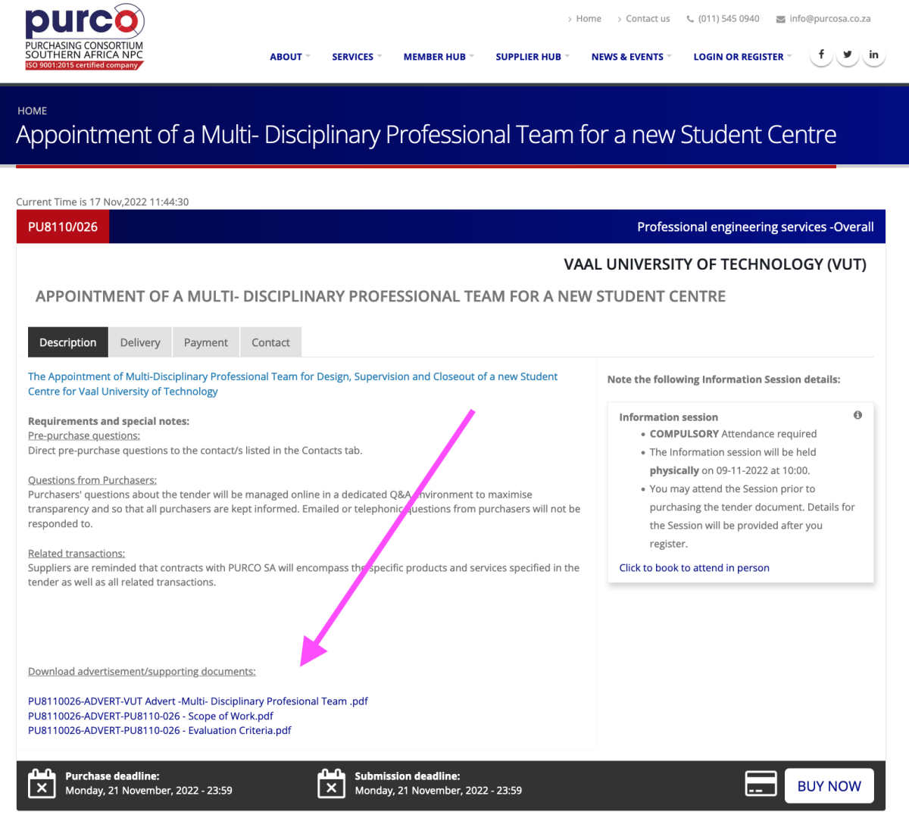
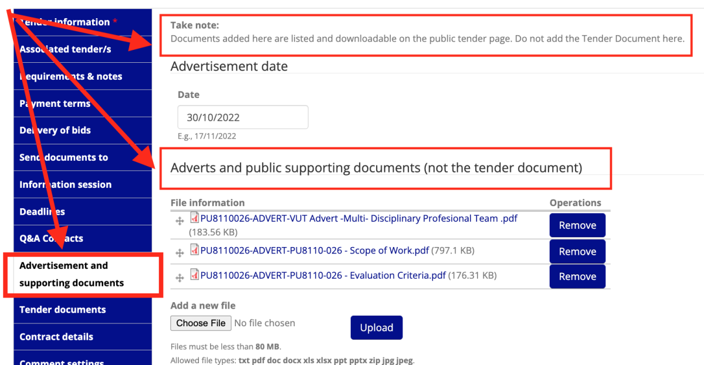

# Adding supporting documents to a tender page

You can provide access to download tender advertisements and supporting documents through a list on the tender page.

**This is what the tender page will look like:**

**This is where you add the advertisements and supporting documents when you create or edit the tender:**

