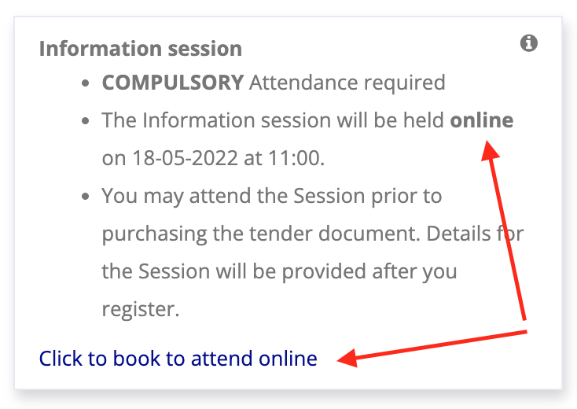
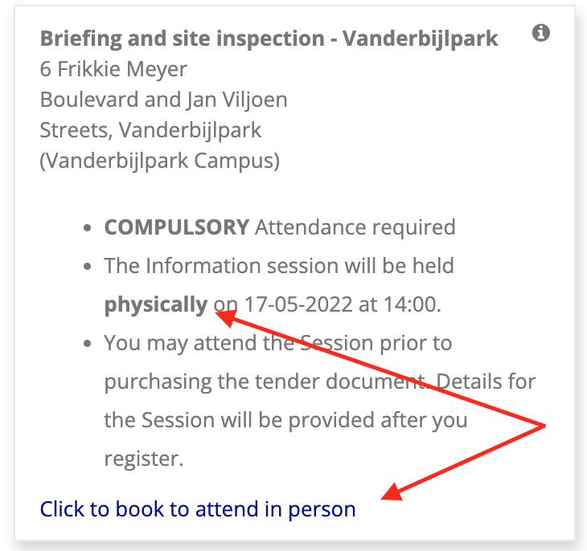
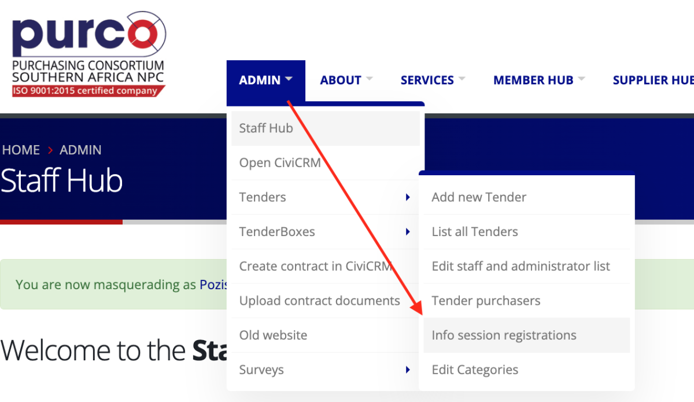
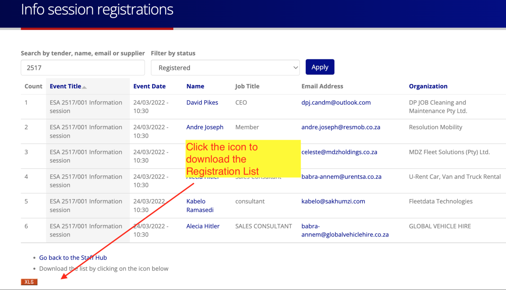
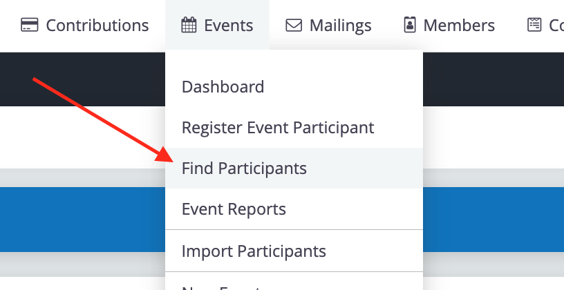
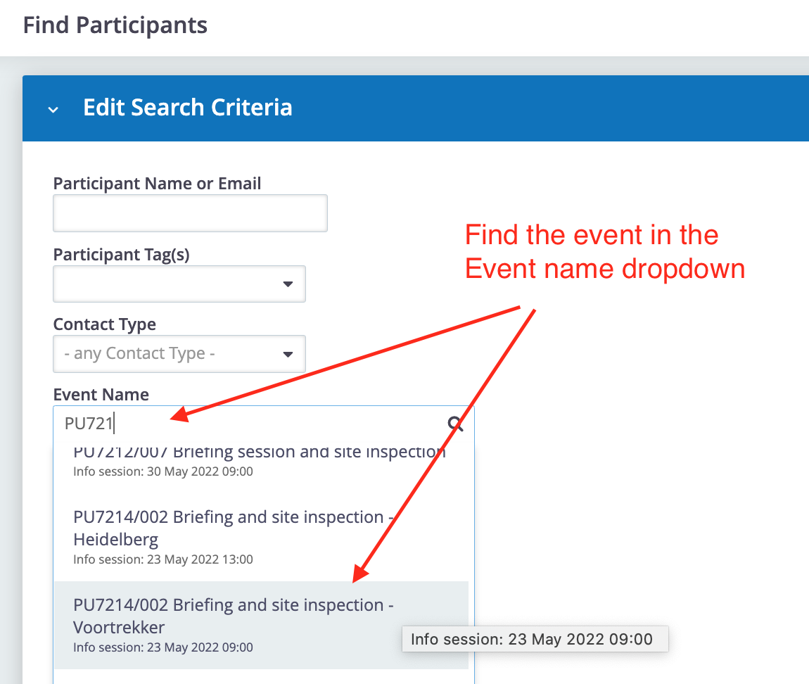
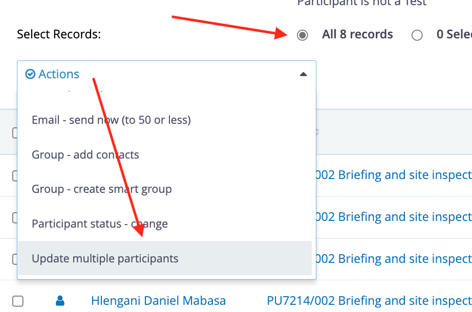
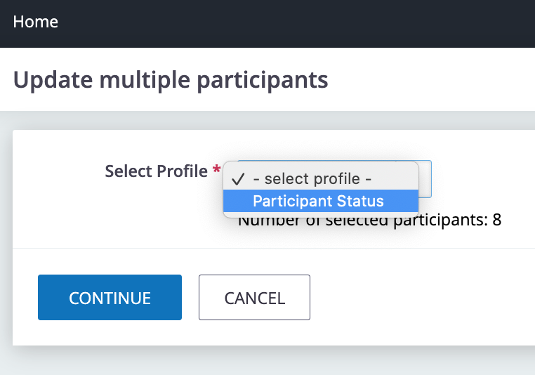
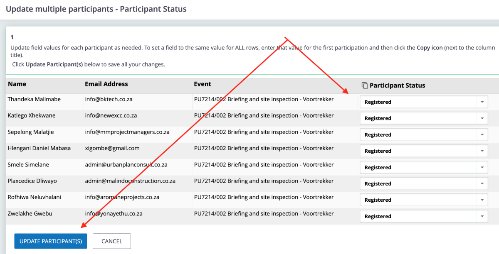

# Information Sessions

## Info Session Block

We have adjusted the wording and design based on feedback from suppliers registering for Info Sessions. Key changes were made to enhance clarity and prevent misunderstandings.

- **Common Issues Encountered**:

    1. Some suppliers failed to attend physical sessions, mistakenly waiting for online meeting details.
    2. Some suppliers thought that clicking the 'Register to attend' link automatically added them to the Attendance Register.

To address these issues, the following changes were made:

- The registration link wording now clarifies whether the session is online or physical.
- Formatting adjustments to bold 'physical' and 'online' for easy identification.

### Examples of the Updated Information Session Block

The above example also has the address reflected in the info session block. While you may want to consider that this may result in people not registering because they already have the venue, date and times, this example demonstrates that you are able to add any additional information onto the form that is necessary for the event.

---

## Why Should Suppliers Register?

We encourage suppliers to register for sessions for several reasons:

- **Future Reference**: Adds attendees to the database for future sessions (e.g., Ponder or Conference).
- **Attendance Tracking**: Provides insights into the expected session attendance.
- **Attendance Registers**: Allows pre-printing of Attendance Registers, making on-site management easier.
- **Manual Work Reduction**: Saves time by eliminating manual data entry of attendees.
- **Audit Integrity**: Ensures an accurate record of participation is maintained in alignment with tender requirements.

---

## Viewing the Registration List

Navigate to the **Admin** section on the site, hover over **Tenders** and select **Info session registrations** from the dropdown.

The Registration List is downloadable but is not to be used as an Attendance Register, see below.

---

## Downloading the Attendance Register

To download the official printable Attendance Register that should be used at the event, a link is provided in the Information Session tab of the Tender Dashboard. See [Tender Dashboard - Information Session Tab](./tender-dashboard.md#information-session-tab).

## Updating Who Attended

Follow these steps to update participant attendance for Info Sessions:

1. Open **CiviCRM**.
2. Select **Events** → **Find Participants**.

    

3. Search for the event by selecting it from the **Event name** dropdown.

    

4. On the search results page, select "All records" and choose **Update multiple participants** from the **Actions** dropdown.

    

5. In the "Update multiple participants" section, select **Participant Status**.

    

6. Use your Attendance Register to update participant statuses (e.g., Attended, Cancelled, No-show). Make sure to apply the appropriate status to each participant.

    

7. Once the updates are saved, the information will be available for future reference and reporting. You can also export the updated data for audits.

---
