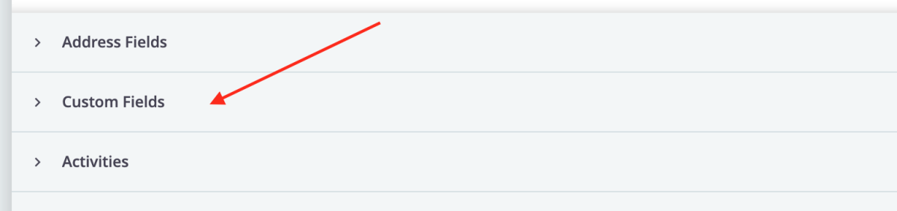
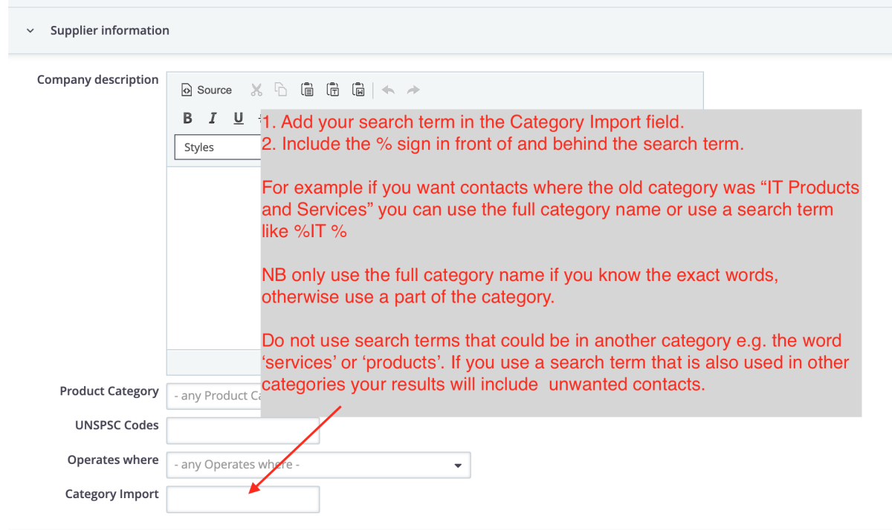
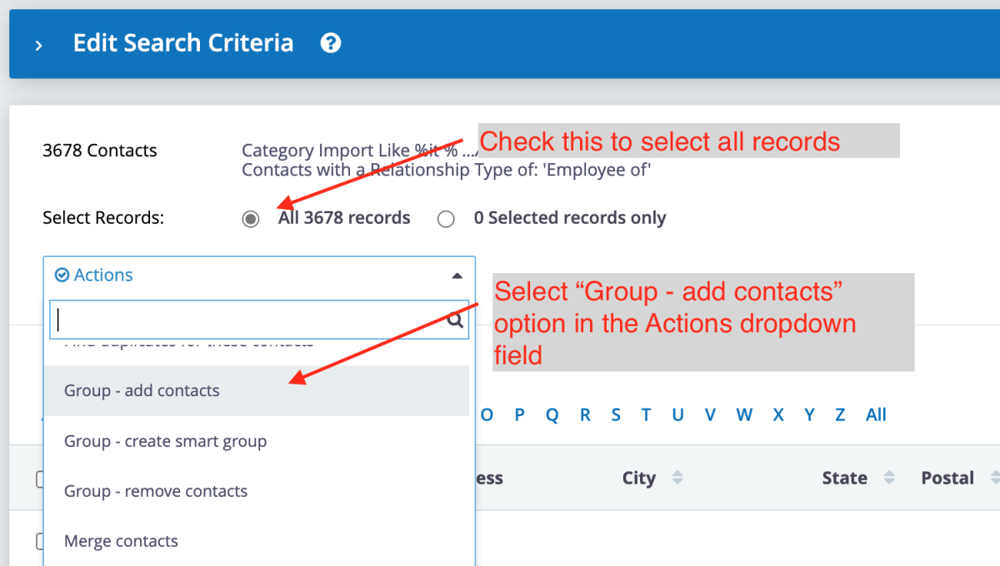
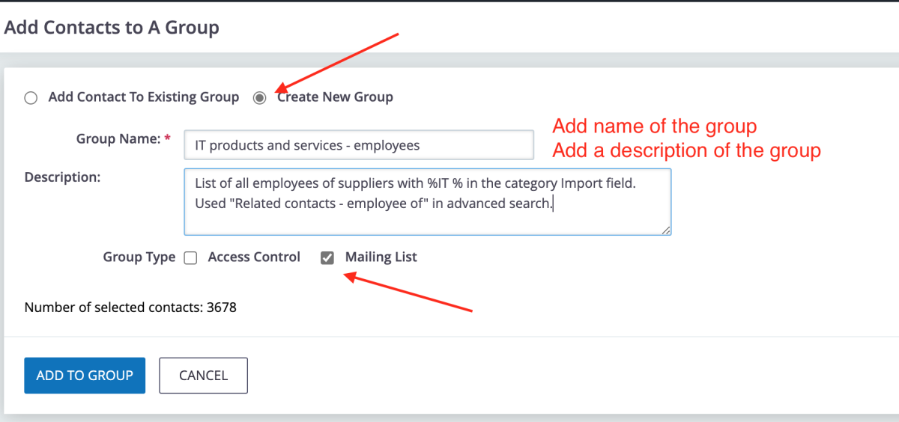

# Creating a tender mailing group

You can create tender invitation mailing groups by searching the "Category import" field with any keyword that was included in the supplier categories from the old site.

**NB** to work effectively add the percentage sign before and after your keyword, e.g. if searching for stationery suppliers use **%stationery%** 

Here is a step by step example:

The old site category was **IT products and services**

1. Open CiviCRM

2. Open the Advanced Search page

3. Select what type of contacts you are searching for:
    - To search for the suppliers' company email addresses:
    
    - To search for the email addresses of employees of the supplier companies:
    

4. Scroll down and select the Custom Fields accordion:

5. Enter your search term in the Category Import field. (This field contains a comma-separated list of all the suppliers' categories). 

6. Select the records and the mailing group option:

7. Create the mailing group :

8. Open the draft tender invitation email and add the new mailing group