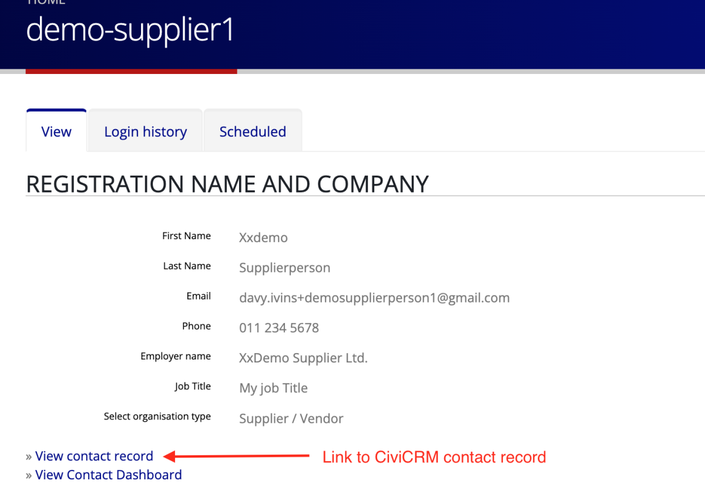

#  Tender Q&A Management

The new Q&A system replaces the previous practice where questions were raised by email, telephone or other means; and answered by email to a manually created distribution list of buyers.

## Why is the tender question and answer system important?

Here are some of the reasons for the new system:

1. **Imroved auditability**
    - By managing all questions and answers engagements via the the website tender page the system retains a secure and accessible record of all Q&As for each tender.
    - Q&A engagements are automatically saved online, rather than on a staff-members' email system and computer.
    - Q&As cannot be edited, deleted or mislaid (other than by action of the system administrator).
2. **Saves you time and effort**
    - All questions and answers are automatically communicated to buyers once approved.
    - No need to set up a separate system with emails or distribution lists
    - No need to recapture questions from emails or other messages.
    - The system automates the communication process.
    - You automatically share Q&As with buyers, and you can add other people who need to be kept informed.
3. **More secure, reliable and accessible**
    - Reduced risk of questions being missed or lost
        - All Q&As are saved on the tender page.
        - A record is retained of all questions and answers and when and by whom they were asked and answered.
    - Improved communication and transparency
        - Tender authors receive emailed Alerts whenever a question or comment is posted.
        - Tender buyers receive automated email Alerts when the tender author approves a question or comment.
        - Email distribution is not 100% reliable, especially with aggressive spam filters. Th e online Q&A system enables buyers to access questions and answers even if they did not receive the email alert.
        - New buyers will see the entire Q&A history on the tender page, including question asked and answered before they bought the tender - you don't have to remember to send them previous communications.
    - Reduced risk of misinterpretation
        - All communications are saved on the system exactly as intended by the buyer or author.
        - This reduces the risk of a telephonic question being misinterpreted, or an emailed question being recaptured incorrectly. 
        - If an answer is inadequate or confusing any buyer can respond for more clarity
    - Better access
        - Q&As are accessible online from anywhere at any time, by any user with appropriate permissions.

**Key takeout:** You have to review and approve every question before it is visible for bidders on the tender page and emailed to purchasers.

## How it works

1. Every tender page has a Q&A section where the tender author (you) and the tender buyers can post comments, questions and answers. It is only visible to the tender author and to buyers.

2. When you create a tender you (the tender author) can immediately post a comment in the Question field and it will be visible to all buyers.

    - Only you and the buyers can see comments, questions and answers.
    - **NB** you and buyers cannot edit or delete questions and answers.This is to protect the audit trail.
    - If you need to edit or delete something, ask the system administrator.

3. Buyers can post questions or reply to other posts. Their posts will not be visible to anyone until approved by the author or system admin. When they post they get this popup message:

4. The system will automatically send you an email Alert that a question has been posted, with a link to the tender page and a copy of the question.

5. You can also get an additional email alert sent to you if you want.
    - Go to your user profile
    
    - Edit your profile and check the 'Receive email notifications' box.
    

6. To approve a question or comment click the link in the email to go to the tender page (or just visit the tender page).
Then click the 'approve' link.

7. When you approve a post it becomes visible on the tender page (only for author and buyers).

8. After you have approved a post you can reply to it or post a separate comment in the Question field.

9. When a post is approved the system automatically sends an email Alert to you, all buyers, and to any email addresses you added in the tender Q&A tab.
    - Below is a screenshot of where you add extra recipients on the Q&A tab when you create/edit a tender.
    - Email recipients listed on the QA tab only receive the email Alert - they cannot see the tender page or comments, and they cannot reply. If they need to reply they should email you to do so. 
    

10. This is what the email alert looks like for a reply to a question:

## What if the author does not approve a post?

- The post will remain on the tender page for audit purposes, but will only be visible to you and to the system administrator.
- Only the system administrator can delete the post.
- You can respond to the user who posted it by clicking on the username, which will take you to the user's profile page.
- The profile page has the buyer's contact details and a link to their CiviCRM contact record. 
- **NB** if you contact the buyer this way the communication is not saved with the Q&A thread.

## Can we edit a question or answer?

Only the system administrator has the necessary permission to edit or delete a post. 
If the administrator does edit a post the system automatically emails an alert to the author and to all buyers with the amended post.  Good practice would be for the administrator to highlight the edit e.g. by writing something like "EDIT: corrected spelling error of word xxx."

If you want to post a supplier's question but the way it is written is confusing or inappropriate we recommend that you don't approve the post. Rather copy or edit it and make your own post e.g. you could post something like "Supplier xx posted the following question which we have edited for clarity: [insert edited question]. The answer is [insert answer]"