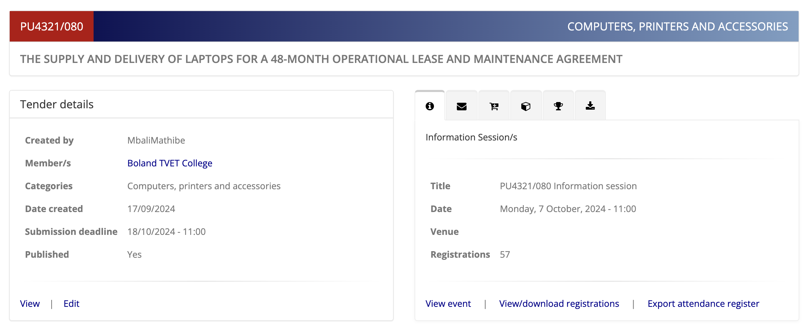
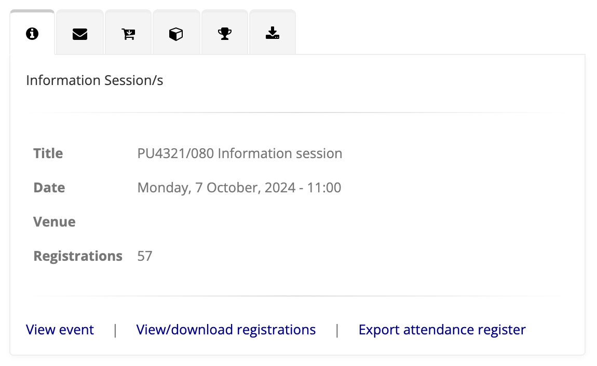
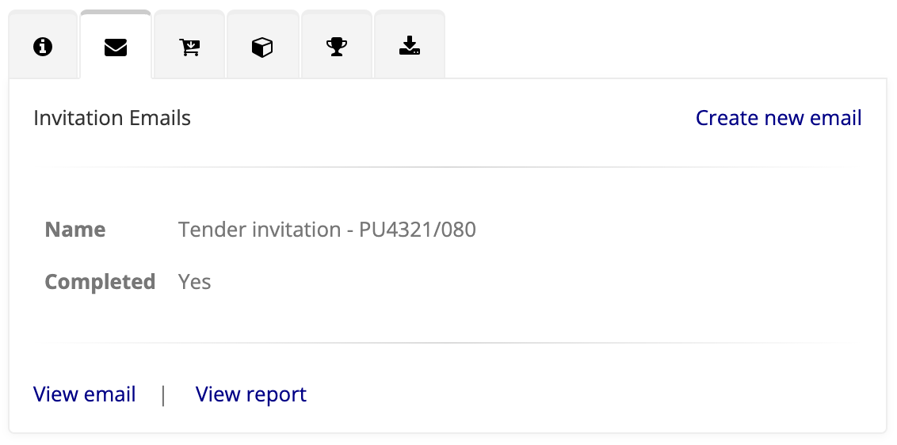
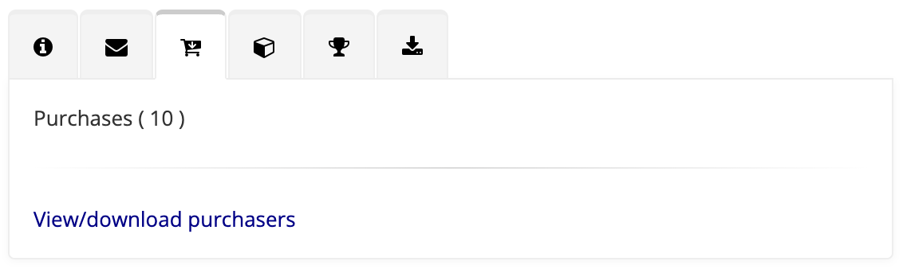
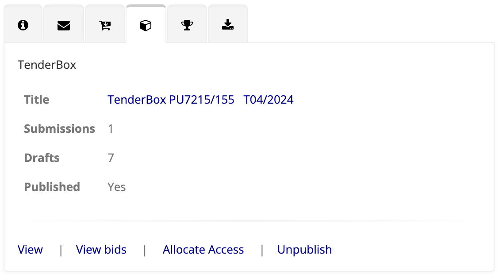
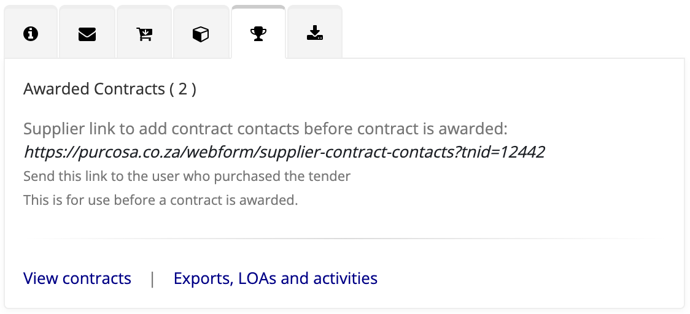
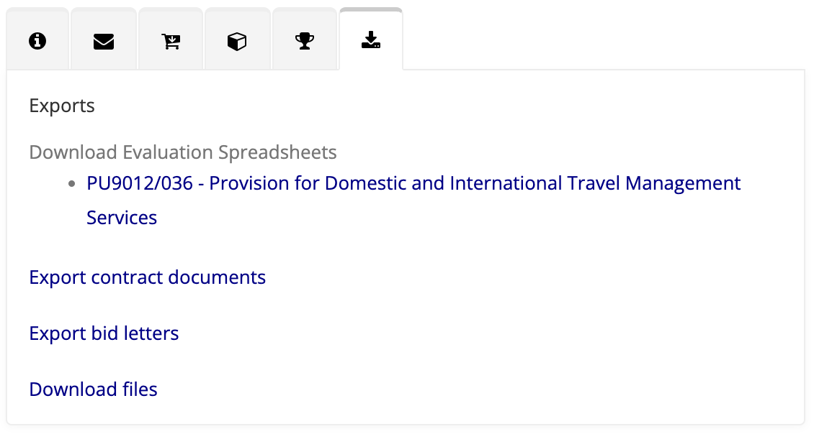

# Tender Dashboard

The Tender Dashboard provides an overview of the tender details and provides easy access to details and actions of related entities via the selectable tabs on the right hand side.

The dashboard layout includes:
- **Tender Details:** Summary information about the tender (creator, associated member, categories, creation date, deadlines, and published status) as well as basic action links.
- **Tabs:** Navigate between key tender-related entities/actions. They appear in this order:
    - **Information Session/s**
    - **Emails**
    - ****:
    - ****:
    - ****:
    - ****:

In the following sections we will discuss each of the available tabs.

---

## Information Session Tab

This tab provides details about any related information sessions.

### Session Details
- **Title:** The name of the session  
- **Date:** The date of the session  
- **Venue:** (Listed here if applicable)  
- **Registrations:** Current number of registrations for this event

### Available Actions
- **View Event:** View the CiviCRM Event info page.
- **View/Download Registrations:** Access the list of registered attendees.
- **Export Attendance Register:** Generate the attendance register to be used at the event.

---

## Emails tab

Two types of emails may be listed here:

- **Invitation Emails**: See [Tender Invitation Mailings](./tender-invitation-mailings.md)
- **Result Email**: Generated after the Contract Awarding process to inform recipients of the winning suppliers.

For each email the name and status is provided as well as links to view the email and view the mailing report.
**NB:** A link is provided at the top right for creating an additional draft invitation email when required.

---

## Purchases

This tab indicates the number of suppliers who have purchased the tender (or registered in the case of a free tender).

A link is provided which leads to the **Tender Buyers** page, listing details of every purchase. A link is provided on the page to download this list.

---

## TenderBox

This tab shows an overview of the TenderBox:

- **Title:** This title also serves as a clickable link to the TenderBox itself. 
- **Submissions:** The number of completed submissions.
- **Drafts:** The number of draft submissions.
- **Published:** Reflects whether or not this TenderBox is currently published.

Various links are available based on the state of the TenderBox.
Examples include:

- **View**: View the TenderBox itself.
- **View bids**: View a list (available pre-deadline) of suppliers who have made submissions (drafts included).
- **Assess bids**: Available after deadline (and for users with access), this links to the Bid Assessment page.
- **Allocate Access**: Modify the access lists for this TenderBox.

---

## Awarded Contracts

The number of awarded contracts is provided. If contracts exist two links are available:

- **View contracts**: View a list of the contracts including links to view and edit the contract documents.
- **Exports, LOAs and activities**: View a list of the contracts including links for exports (such as the LOA) and activities related to the contract (including LOA downloads).

For convenience, the **Supplier Contract Contacts Form** link is also provided in this tab. This is the link that should be given to winning suppliers in order for them to capture the details of their contacts who will be handling this contract.

---

## Exports

The availablity of exports depends on the progress of the Tender process.
The following links may be available:

- **Evaluation Spreadsheets**: Download the evalution spreadsheet for each TenderBox component.
- **Contract Documents**: Download contract-based documents, e.g. Finance LOA.
- **Bid Letters**: Download Successful / Unsuccessful Letters for individual suppliers.
- **Files**: Download all the bid files submitted by the suppliers.

---
