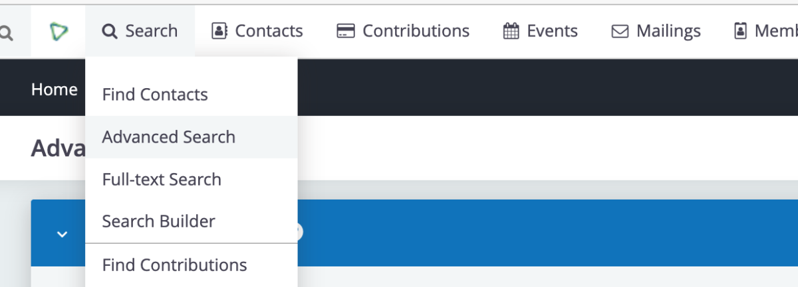
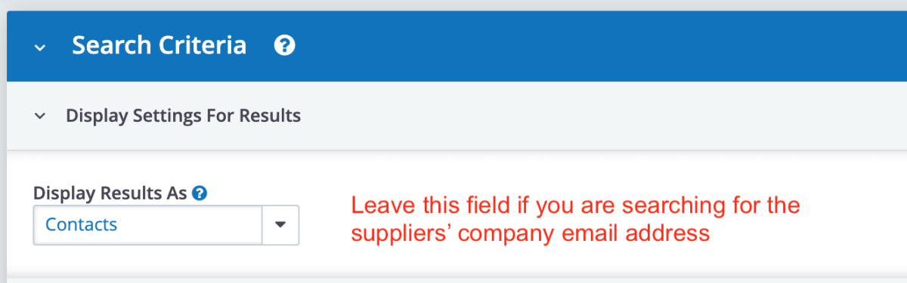
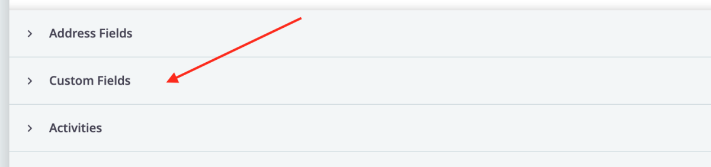
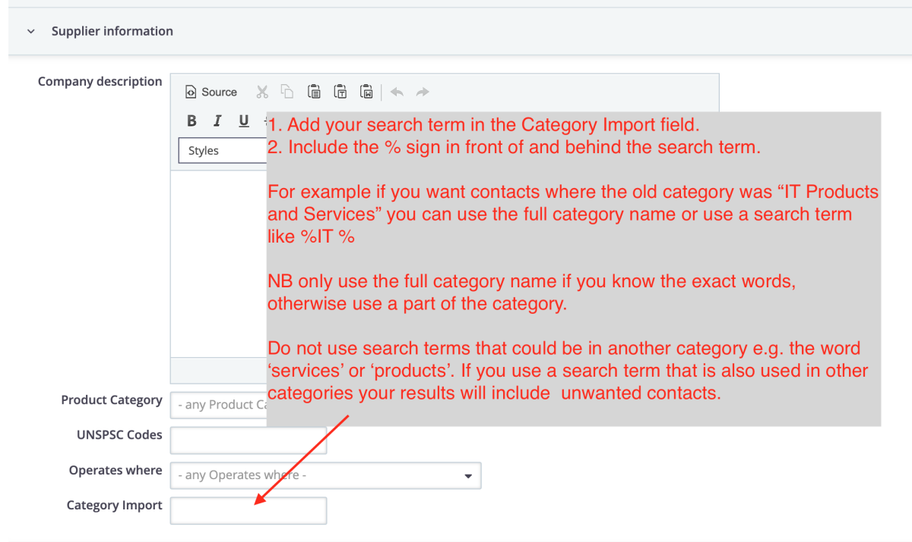
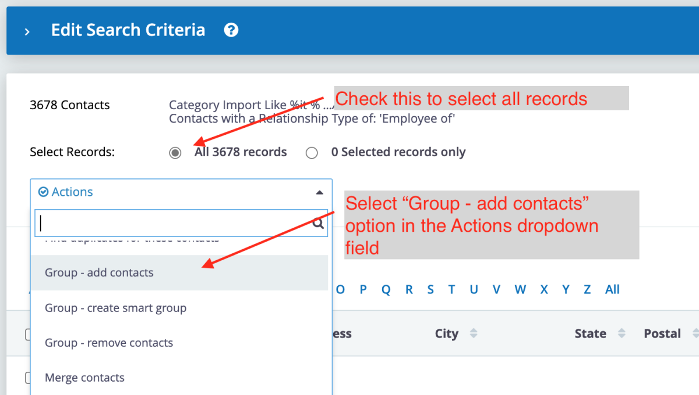
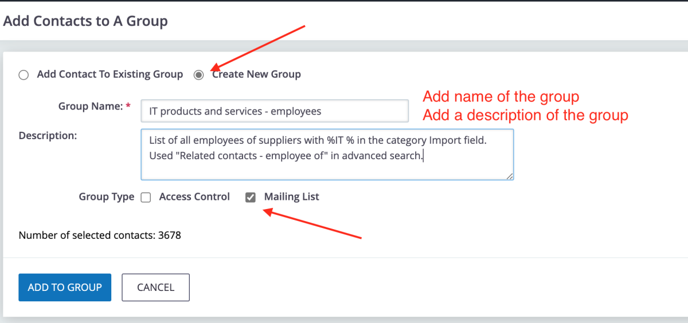

# Tender Invitation Mailings

Tender invitation mailings are automatically created (as unsent drafts) when a new tender is created, and automatically updated when editing an existing tender (provided of course that mailing has not yet been sent).

If for any reason more than one invitation email is required, additional drafts should be created manually but rather through the Emails tab in the **Tender Dashboard**. See [Tender Dashboard - Emails Tab](./tender-dashboard/#emails-tab). This ensures the additional emails are correctly linked to the tender record.

## Creating a Tender Mailing Group

You can create tender invitation mailing groups by searching the "Category import" field with any keyword that was included in the supplier categories from the old site.

**NB** to work effectively add the percentage sign before and after your keyword, e.g. if searching for stationery suppliers use **%stationery%** 

Here is a step by step example:

The old site category was **IT products and services**

1. Open CiviCRM

2. Open the Advanced Search page

3. Select what type of contacts you are searching for:
    - To search for the suppliers' company email addresses:
        
    - To search for the email addresses of employees of the supplier companies:
        

4. Scroll down and select the Custom Fields accordion:

5. Enter your search term in the Category Import field. (This field contains a comma-separated list of all the suppliers' categories). 

6. Select the records and the mailing group option:

7. Create the mailing group :

---

## Sending / Scheduling a Mailing

1. Click "Open CiviCRM" from the ADMIN menu.

2. In CiviCRM, Click "Draft Mailings" under the Mailings menu.

3. Find the correct draft mailing in the list and click "Continue".

4. For the "From" field, select the email address that should be used as the from address for this mailing.

5. In the "Recipients" box, type to search for the relevant mailing group and select it.

6. At the bottom of the screen you are able to send yourself this email as a test.

7. After confirming that the email content is correct click the "Next" button.

8. You will presented with an overview of the configuration for the mailing. By default\
"Send immediately" is selected. If you wish to schedule the sending of the email for a later time/date, select "Send at" and specify the desired date and time.

9. Click the "Submit Mailing" button.

---

## Exporting Mailing Reports

1. Ensure that you are logged in.

2. Click "Open CiviCRM"

3. Click "Scheduled and Sent Mailings"

This step opens the list of all sent or scheduled mailings.
Now search for your mailing. You can use Control-F or search by the Mailing Name, Date or who Created / sent it. 

In this example we will enter a part of Pozisa's name to search for her mailings.

4. Click the "Created or Sent by" field.

5. Type a part of the name you are looking for. 
In this case we enter "pozi"

6. Click "SEARCH"

This returns a list of Pozisa's mailings.

Find the mailing and click on "Report".

7. Click "Report"

On the next page you will see a list of all the available reports. Choose the one you want to download. In this example we will download the top report.

8. Click "Report"

You will now see the mailing list.

9. Click "Actions"

10. Click "Export as CSV"

---

## Protecting the PURCO SA Email Reputation

An organisation's email reputation is invaluable. If it is damaged, PURCO SA risks being blacklisted, preventing email delivery. CiviCRM has built-in processes to protect the PURCO SA email reputation, but your support is required.

### Types of Email Bounces

There are two types of email bounces:

- **Hard bounces**: 
  - Occur when the email address is invalid, the domain does not exist, or the receiving server blocks delivery from your domain or IP address.
  - Can result from poor sending reputation and may negatively impact the organisation’s reputation if emails are repeatedly sent to these addresses.

- **Soft bounces**: 
  - Happen when a recipient's mailbox is full, the email server is down or offline, or when multiple emails are sent to the same address in a short time.

---

### How Our System Protects the Reputation

- **Hard bounces**: 
  - CiviCRM immediately puts emails "on hold."
  
- **Soft bounces**: 
  - After several bounces (e.g., 3 bounces for a full inbox or 30 bounces for a vacation message), CiviCRM places the email on hold.

- **All CiviCRM emails**: 
  - Include an option for recipients to opt-out of receiving future emails, which automatically puts the email on hold within the system.

We also use an external service (Sparkpost.com) for email delivery. Sparkpost's suppression system prevents emails from being sent to invalid addresses or addresses that bounce repeatedly. If an email appears to be fine in CiviCRM but is blocked by Sparkpost, the recipient can contact Davy to verify if the address is on the Sparkpost suppression list.

---

### How to Protect the PURCO SA Email Reputation

1. **Do not email "everyone"** for a tender—only email those who meet the specific criteria.
2. **Avoid multiple bulk emails** to the same recipients on the same day.
3. **Try to avoid large attachments** when sending bulk emails.
4. **Check the bounce list** after every mailing report:
    - If there are many bounces, contact **Davy** to investigate.
    - If there are only a few bounces, click on "Bounces" to review the reason for each address.

    ### Handling Hard Bounces
    - If a member contact bounces, reach out to the institution to confirm whether the address needs removal.
    - If a supplier contact bounces, confirm if an alternative address is available, or remove the address (and company) from the system.

    ### Handling Spam Filter Bounces
    - If spam filters cause many bounces, contact **Davy** to investigate.
    - If a supplier's spam filter blocks the email, request that they whitelist all emails from **purcosa.co.za**.

    ### Handling Soft Bounces
    - If the person is still relevant, you can "un-hold" them in CiviCRM.
    - If the person or company is no longer relevant, consider removing them from the system.

5. **Check the opt-out list** after every mailing:
   - If a member has opted out, confirm before removing them.
   - If a supplier with a contract opts out, confirm if an alternative address is available, or update their contact details.
   - If a supplier without a contract opts out, remove their details (and their company if necessary).

---

For more information, refer to the official CiviCRM documentation on [Maintaining Healthy Email Lists](https://docs.civicrm.org/user/en/latest/email/maintaining-healthy-email/).
